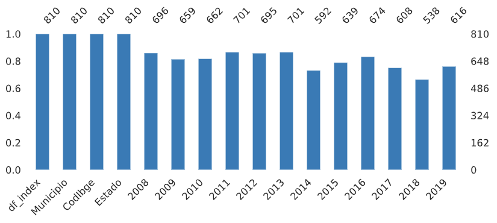
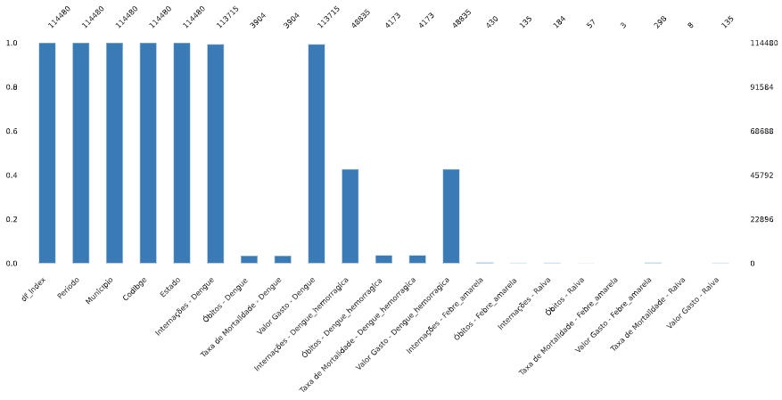
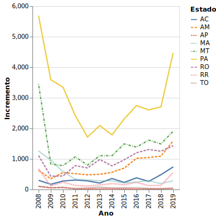
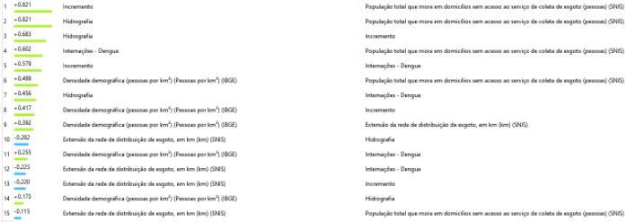
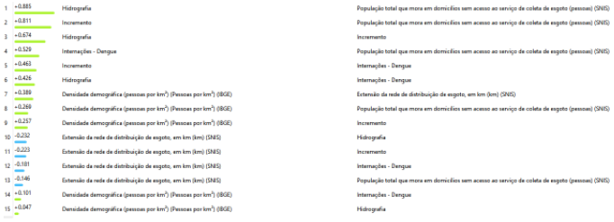

# Desmatamento e Doenças Emergentes: Novas Perspectivas dos Impactos Causados pela Exploração Ambiental em Zoonoses Emergentes
# Deforestation and Emerging Diseases: New Perspectives on the Impacts Caused by Environmental Exploitation in Emerging Zoonoses

# Apresentação

O presente projeto foi originado no contexto das atividades da disciplina de pós-graduação [*Ciência e Visualização de Dados em Saúde*](https://github.com/datasci4health/home), oferecida no primeiro semestre de 2021, na Unicamp.

# Equipe
| Nome                         | RA     | Especialização |
|------------------------------|--------|----------------|
| Beatriz Cunha Freire         | 261067 | Computação |
| Bruna Moraes Lopes           | 216050 | Engenharia |
| George Corrêa de Araújo      | 191075 | Computação |
| Luidy Kazuo Issayama         | 136703 | Saúde |
| Stephanie Villa-Nova Pereira | 154410 | Saúde |

# Descrição Resumida do Projeto
A dengue é uma doença infecciosa transmitida por mosquitos do gênero *Aedes* , principalmente pela espécie *Aedes aegypti*, e causada por arbovírus membros da família Flaviviridae, com quatro sorotipos diferentes: DENV-1, DENV-2, DENV-3 e DENV-4. Somente no Brasil, em 2019, foram registrados 1.544.987 casos de dengue, o que mostra que ainda é um fator de risco muito grande para a população [[1]](https://www.gov.br/pt-br/noticias/saude-e-vigilancia-sanitaria/2020/02/populacao-deve-ficar-atenta-a-proliferacao-do-aedes-aegypti-durante-periodo-chuvosa). Diferente de outras doenças tropicais negligenciadas, ela tem ganhado atenção mundial, devido a uma alta incidência - afetando 125 países e causando aproximadamente 100 milhões de casos sintomáticos por ano [[2]](https://www.nature.com/articles/nature12060) -, bem como um aumento na migração e adaptação dos vetores a climas temperados como Europa e América do Norte [[3]](https://journals.plos.org/plosntds/article?id=10.1371/journal.pntd.0007213). Além do clima ser um fator contribuinte para a migração e adaptação destes insetos, o desmatamento também é um fator de risco que promove a exposição de novos vírus e novas variantes de vírus aos seres humanos, já que a Amazônia é um dos maiores repositórios de arbovírus do mundo[[4]](https://pesquisa.bvsalud.org/portal/resource/pt/lil-188336).

O desmatamento é uma prática que consiste na retirada parcial ou total da cobertura vegetal de uma região. Na região amazônica, tem aumentado sucessivamente nos últimos 5 anos, alcançando as maiores taxas de desmatamento da década em 2020 [[5]](https://www.nature.com/articles/s41559-020-01368-x). Adicionalmente, de acordo com um relatório publicado pela Sociedade Vegetariana Brasileira, cerca de 70% da área desmatada na área da Amazônia é designada para a criação de gado  [[6]](https://www.cifor.org/publications/pdf_files/media/Amazon.pdf) [[7]](https://iopscience.iop.org/article/10.1088/1748-9326/5/2/024002/pdf). Estes fatores em conjunto podem ter uma grande contribuição no comportamento de migração, na proliferação e sobrevivência dos mosquitos, visto que influenciam na alteração climática e aquecimento global [[8]](https://wwf.panda.org/discover/knowledge_hub/where_we_work/amazon/amazon_threats/climate_change_amazon/?#:~:text=The%20changing%20nature%20of%20the,%2C%20agriculture%2C%20and%20human%20health)

Dado isso, estudar fatores influentes para o aumento de casos de dengue, nos auxilia a elaborar modelos estatítsticos mais precisos e mais preditivos de quando os surtos podem surgir, já que atualmente, os modelos existentes levam em consideração principalmete dados de temperatura e dados de saúde de baixa qualidade [[9]](https://pubmed.ncbi.nlm.nih.gov/25730702/). Portanto, o objetivo principal deste trabalho é compreender o impacto do desmatamento no aumento de número de casos de internação por dengue na região da Amazônia Legal - que apresenta os maiores índices de desmatamento do Brasil -, através de análises de correlações e testes de hipóteses com amostras estabelecidas a partir de critérios de desmatamento e internações. Foi levantado a possibilidade de utilização de modelos de regressão linear múltipla para investigar a influência de mais de uma váriavel nos aumentos de casos de internação. 

[Vídeo de apresentação](https://youtu.be/YkhxoM7QYJ0)

# Perguntas de Pesquisa
- O desmatamento contribui para o aumento de casos de dengue na região da Amazônia legal?
  - Existem outros fatores que podem contribuir para o aumento de casos de internações?
  - Existe diferença no número de casos de internações em estados com maiores e menores índices de desmatamento?

# Bases de Dados
Para informações sobre o desmatamento podemos utilizar a base de dados criada pelo Instituto Nacional de Pesquisas Espaciais (INPE) e disponibilizada através do portal TerraBrasilis. Quanto a informações sobre doenças podemos utilizar informações públicas fornecidas pelo DATASUS.

# Metodologia
Para a realização deste trabalho os seguintes passos serão necessários:
- análise dos dados, interpretação e seleção de subconjuntos de interesse;
- limpeza e normalização dos dados;
- análise de métodos de data mining aplicáveis ao problema;
- realização de data mining;
- avaliação e visualização dos resultados;
- publicação dos resultados obtidos.

O ciclo de análise dos dados à avaliação dos resultados poderá ser repetido diversas vezes, até o momento em que o conhecimento necessário para a resposta das perguntas de pesquisa seja obtido.

## Bases de Dados e Evolução

### Bases Estudadas e Não Adotadas

| Base de Dados | Endereço na Web | Resumo |
| -- | -- | -- |
| Doenças e Agravos de Notificação | [DATASUS](http://www2.datasus.gov.br/DATASUS/index.php?area=0203&id=34523091&VObj=http://tabnet.datasus.gov.br/cgi/deftohtm.exe?sinannet/cnv/dengueb) | Para o número de notificações, são incluídas notificações de indivíduos residentes no Brasil, independente de sua confirmação, exceto os descartados, pois em situações de epidemia nem sempre é possível confirmar todos os casos. |

#### Obtenção das Bases

O número de notificações foi obtido a partir da filtragem dos dados epidemiológicos e morbidade do TABNET (Doenças e Agravos de Notificação - 2007 em diante (SINAN). Após a seleção `Dengue até 2013` ou `Dengue de 2014 em diante` por estado, foram separados os filtros com todos os períodos disponíveis: Linha - `município de residência`; Coluna - `mês o primeiro sintoma`; Conteúdo - `Casos prováveis`.

#### Pré-Processamento e Análise Inicial

As informações de doenças e agravos de notificação possuem informações sobre várias doenças, porém para este trabalho focamos nas informações sobre a dengue. Mais especificamente, selecionamos os dados de notificação do primeiro sintoma de dengue, agupados por mês/ano. Toda a análise feita nesses dados pode ser visualizada em um [notebook](notebooks/Pr%C3%A9_Processamento_Dados_de_Doen%C3%A7as.ipynb) ou [colab](https://colab.research.google.com/drive/1rdaYe6WFL_gSABGVkmvFvD-s-gs1THQK?usp=sharing).

Durante o carregamento dos dados, várias etapas de limpeza e adequação foram necessárias. Primeiramente foram removidas a linha e coluna que contém a soma (`Total`) e a coluna `Ign/Em Branco`, quando presente. Em seguida, criamos a coluna `Estado` com a respectiva informação e dividimos a coluna referente ao município em duas colunas: `Municipio` e `CodIbge`. Posteriormente, substituímos os valores `-` por `0`, visto que seus valores eram computados como 0 na linha e coluna `Total`.

Analisando individualmente os anos para o mesmo estado, percebemos variação na quantidade de municípios, o que indica que nem todos os municípios possuem informações de todos os anos. Para adicionar esses dados na tabela como dados faltantes (`NaN`), criamos uma lista composta por todos os municípios daquele estado que possuem informação em algum dos anos. A partir dessa lista adicionamos o nome daquele município em todos os anos, preenchendo os valores com `NaN` quando não anteriormente presente, de modo que a informação daquele estado para todos os anos possuam a mesma quantidade de municípios.

Como os dados de desmatamento possuem granularidade anual, aglutinamos as informações por ano, de modo a gerar uma tabela por estado, com informações anuais de cada município daquele estado. Num passo final, agregamos todas as tabelas em uma única, contendo todos os municípios de todos os estados, com informações anuais de notificação do primeiro sintoma de dengue.

Durante uma análise exploratória inicial, percebemos a grande quantidade de dados faltantes, chegando a ser, em algumas colunas, mais de 30% dos valores. De 810 municípios contidos nos dados, 272 deles (33.6%) não possuem informação sobre notificações para o ano de 2018, por exemplo. Uma análise visual dos valores faltantes pode ser observado nas figuras abaixo.

Para verificar o real impacto dos dados faltantes, optamos por comparar a quantidade de municípios total e a quantidade de municípios com todas as informações completas, agrupados por estado. Através da tabela abaixo, podemos verificar que a maior parte dos municípios possui alguma informação faltante. De 810 municípios, somente 297 possuem informações para todo o período de 2008 a 2019. Há estados que possuem uma quantidade muito pequena de dados completos, como o Amapá e o Amazonas, e estados que inclusive não possuem informação total de nenhuma cidade, como é o caso de Roraima. Devido à quantidade reduzida de dados completos, optamos por descartar esta base de dados.

| Estado   |   Total de Municípios |   Municípios Completos |
|----------|-----------------------|------------------------|
| AC       |                    22 |                     10 |
| AP       |                    17 |                      4 |
| AM       |                    62 |                      8 |
| MA       |                   217 |                     39 |
| MT       |                   142 |                     84 |
| PA       |                   142 |                     71 |
| RO       |                    53 |                     28 |
| RR       |                    15 |                      0 |
| TO       |                   140 |                     53 |
| Total    |                   810 |                    297 |

### Bases Estudadas e Adotadas

| Base de Dados | Endereço na Web | Resumo |
| -- | -- | -- |
| Desmatamento nos Municípios da Amazônia Legal | [PRODES Amazônia](http://www.dpi.inpe.br/prodesdigital/prodesmunicipal.php) | A estimativa de extensão desmatada por município baseia-se no cálculo do desmatamento acumulado e observado até 2019 dentro dos limites administrativos  dos municípios que fazem parte da Amazônia Legal. Além da classe com a extensão desflorestada, as áreas de outras classes de cobertura da terra  e nuvem, foram calculadas  para cada ano de análise como: floresta, nuvem, não floresta, hidrografia e área não observada. |
| Morbidade Hospitalar do SUS | [DATASUS](http://www2.datasus.gov.br/DATASUS/index.php?area=0203&id=6927&VObj=http://tabnet.datasus.gov.br/cgi/deftohtm.exe?sih/cnv/nr) | O número de internações por dengue representa todos os casos registrados e confirmados no período, separados por mês, ano de notificação e município que registrou o caso. |

#### Obtenção das Bases

Os dados de desmatamento foram obtidos a partir da seleção dos dados no sistema da PRODES. Para tal, é necessário selecionar na opção `Estado/Região` a Amazônia Legal, alterando o ano entre 2008 a 2019. Após esse passo, geramos a lista, e ao fim da mesma há a opção `Gera arquivo .txt`.

O número de internações foi obtido a partir da filtragem dos dados epidemiológicos e morbidade do TABNET. Após a seleção `geral, por local de residência - a partir de 2008` por estado, foram separados os filtros com todos os períodos disponíveis: Linha - `municípios`; Coluna - `Ano/mês de atendimento`; Conteúdo - `internações`. Por fim, nas seleções, foi selecionado `Dengue` na `Lista Morb CID-10`, para filtrar apenas os casos de Dengue.

#### Pré-Processamento e Análise Inicial

O pré-processamento dos dados de desmatamento exigiu poucos passos, visto a completude e qualidade dos dados disponibilizados. Os passos necessários foram somente carregar os dados utilizando a codificação correta (`latin`) devido aos caracteres especiais e descartar as colunas `Latgms`, `Longms` e `CodIbge`. A coluna `CodIbge` foi descartada após avaliarmos que o código do IBGE contido nos dados de desmatamento possui um dígito a mais que o mesmo código nos dados de internação, gerando discrepâncias. Após esses passos, unimos a informação de todos os anos em uma única tabela.

Como um passo adicional, optamos por adicionar a informação de percentual de área desmatada até aquele ano. Geramos quatro versões dos dados de desmatamento: uma versão com informações por município ([dados_desmatamento.csv](data/processed/dados_desmatamento.csv)), uma versão com informações agrupadas por estado ([dados_desmatamento_estado.csv](data/processed/dados_desmatamento_estado.csv)), e uma versão destes dois dados com uma coluna extra `Ano` ([dados_desmatamento_col_ano.csv](data/processed/dados_desmatamento_col_ano.csv) e [dados_desmatamento_estado_col_ano.csv](data/processed/dados_desmatamento_estado_col_ano.csv)), de modo a facilitar a geração de gráficos com informações temporais. Todo o processo de pré-processamento dos dados de desmatamento pode ser replicado neste [notebook](notebooks/Pr%C3%A9_Processamento_Dados_de_Desmatamento.ipynb) ou [colab](https://colab.research.google.com/drive/1AsiwT2YpcR69EVzump4aTx-ZVmwZ_gA8?usp=sharing).

Inicialmente, com os dados hospitalares, havíamos decidido utilizar informações sobre quatro doenças: dengue, dengue hemorrágica, febre amarela e raiva, considerando todos os nove estados que compõem a Amazônia Legal. As informações referentes a cada doença que buscamos foram: internações, óbitos, taxa de mortalidade e valor gasto. O pré-processamento realizado pode ser verificado neste [notebook](notebooks/Pr%C3%A9_Processamento_Dados_Hospitalares.ipynb) ou neste [colab](https://colab.research.google.com/drive/1KlttoMcMMMOPWFxvCS6Z_nQh6D6_TL18?usp=sharing).

O primeiro passo ao carregar os dados foi descartar a última linha e coluna, referente ao valor total. Foi criada a coluna `Estado` com a devida informação e as colunas `Municipio` e `CodIbge` a partir das informações do município contidas na tabela. Os valores `-` foram substituídos por `0`, por serem computados desta forma na linha/coluna total. Um próximo passo foi padronizar os dados, adicionando informações dos municípios faltantes em cada ano, de modo que as informações anuais dos estados possuam a mesma quantidade de municípios. Desta forma, foi possível aglutinar as informações por estado, e posteriormente em uma única tabela.

Ao analisarmos a completude dos dados, decidimos por focar nossos estudos na dengue, mais especificamente nos dados de internações por dengue. De 114.480 linhas em nossa tabela, que envolvem informações sobre todos os municípios para cada mês, somente `Internações` e `Valor Gasto` possuem uma porcentagem pequena de dados faltantes. Uma tabela com maiores informações sobre as colunas analisadas, assim como uma figura demonstrando visualmente a completude dos dados, podem ser visualizadas abaixo.

| Doença             | Informação          |   Dados faltantes |   % dados faltantes |
|--------------------|---------------------|-------------------|---------------------|
| Dengue             | Internações         |               765 |                0.67 |
|                    | Óbitos              |            110576 |               96.59 |
|                    | Taxa de Mortalidade |            110576 |               96.59 |
|                    | Valor Gasto         |               765 |                0.67 |
| Dengue_hemorragica | Internações         |             65645 |               57.34 |
|                    | Óbitos              |            110307 |               96.35 |
|                    | Taxa de Mortalidade |            110307 |               96.35 |
|                    | Valor Gasto         |             65645 |               57.34 |
| Febre_amarela      | Internações         |            114050 |               99.62 |
|                    | Óbitos              |            114345 |               99.88 |
| Raiva              | Internações         |            114296 |               99.84 |
|                    | Óbitos              |            114423 |               99.95 |
| Febre_amarela      | Taxa de Mortalidade |            114477 |              100    |
|                    | Valor Gasto         |            114182 |               99.74 |
| Raiva              | Taxa de Mortalidade |            114472 |               99.99 |
|                    | Valor Gasto         |            114345 |               99.88 |

Após descartarmos as colunas referentes às outras doenças e dados hospitalares, agrupamos as informações mensais por ano. Geramos novamente quatro versões dos dados: uma versão com informações por município ([dengue_internacoes.csv](data/processed/dengue_internacoes.csv)), uma versão com informações agrupadas por estado ([dengue_internacoes_estado.csv](data/processed/dengue_internacoes_estado.csv)), e uma versão destes dois dados com uma coluna extra `Ano` ([dengue_internacoes_col_ano.csv](data/processed/dengue_internacoes_col_ano.csv) e [dengue_internacoes_estado_col_ano.csv](data/processed/dengue_internacoes_estado_col_ano.csv)), de modo a facilitar a geração de gráficos com informações temporais.

### Integração entre Bases e Análise Exploratória

Optamos por realizar inicialmente uma análise exploratória nas bases individualmente e, somente depois, integrar os dados em uma única base e realizar sua análise.

#### Análise Exploratória nas Bases Separadas

A análise exploratória dos dados de desmatamento foi realizada em um [notebook](notebooks/An%C3%A1lise_Explorat%C3%B3ria_Dados_de_Desmatamento.ipynb), através deste [colab](https://colab.research.google.com/drive/1AsiwT2YpcR69EVzump4aTx-ZVmwZ_gA8?usp=sharing). Iniciamos sua análise verificando a completude dos dados. Podemos verificar por meio da tabela abaixo que os dados de desmatamento não possuem nenhum dado faltante.

| Coluna        |   Dados Faltantes |
|---------------|-------------------|
| Lat           |                 0 |
| Long          |                 0 |
| Municipio     |                 0 |
| Estado        |                 0 |
| AreaKm2       |                 0 |
| Ano           |                 0 |
| Desmatado     |                 0 |
| Incremento    |                 0 |
| Floresta      |                 0 |
| NaoFloresta   |                 0 |
| Hidrografia   |                 0 |
| PercDesmatado |                 0 |

Analisamos também o incremento de desmatamento anual de cada estado. Para todos os anos, o Pará foi o estado com maior acréscimo de área desmatada. Essa informação fica clara ao analisarmos a figura abaixo. Podemos perceber que houve, principalmente nos estados de Mato Grosso e Pará, uma redução significativa no incremento da área desmatada. Isso se deve, provavelmente, ao aumento da fiscalização ambiental que ocorreu nos anos do governo [Lula](https://observatorio-eco.jusbrasil.com.br/noticias/2520623/legislacao-ambiental-do-governo-lula). Posteriormente, no governo [Dilma](https://www.bbc.com/portuguese/brasil-49683787), houve uma flexibilização da política ambiental, o que levou novamente ao crescimento do desmatamento.

Quanto aos municípios, [São Félix do Xingu](https://earth.google.com/web/@-6.79676284,-51.8369192,256.38213797a,281025.34688607d,35y,6.99026636h,0t,0r/data=CjISMBIgNTQ0MGExNzMxYzI1MTFlYTk0NDM4YmI2ODk0NDUyOTciDG1haW5Ob1JhbmRvbQ) (PA), [Porto Velho](https://earth.google.com/web/@-8.7611605,-63.90043028,94.00000864a,49760.98087303d,35y,7h,0t,0r/data=CjISMBIgNTQ0MGExNzMxYzI1MTFlYTk0NDM4YmI2ODk0NDUyOTciDG1haW5Ob1JhbmRvbQ) (RO) e [Altamira](https://earth.google.com/web/@-3.22960653,-52.1569634,122.49219257a,61809.78760075d,35y,6.99690431h,0t,0r/data=CjISMBIgNTQ0MGExNzMxYzI1MTFlYTk0NDM4YmI2ODk0NDUyOTciDG1haW5Ob1JhbmRvbQ) (PA) foram os mais afetados por desmatamento no período de 2008 a 2019. O efeito do desmatamento nessas regiões pode ser visto por meio dos links relacionados aos mesmos.

| Período   | Município          | Estado   |   Área (km2) |
|-----------|--------------------|----------|--------------|
| 2007/2008 | São Félix do Xingu | PA       |        765.1 |
| 2008/2009 | São Félix do Xingu | PA       |        444.4 |
| 2009/2010 | São Félix do Xingu | PA       |        353.7 |
| 2010/2011 | Porto Velho        | RO       |        324.9 |
| 2011/2012 | Altamira           | PA       |        229.9 |
| 2012/2013 | Porto Velho        | RO       |        315.6 |
| 2013/2014 | Altamira           | PA       |        293.9 |
| 2014/2015 | Altamira           | PA       |        308.6 |
| 2015/2016 | Altamira           | PA       |        409.5 |
| 2016/2017 | Porto Velho        | RO       |        353.4 |
| 2017/2018 | Altamira           | PA       |        435   |
| 2018/2019 | Altamira           | PA       |        575.4 |

[notebook hosp](notebooks/An%C3%A1lise_Explorat%C3%B3ria_Dados_Hospitalares.ipynb)
[colab hosp](https://colab.research.google.com/drive/1KlttoMcMMMOPWFxvCS6Z_nQh6D6_TL18?usp=sharing)

#### Integração entre Bases

[notebook aglut](notebooks/Pr%C3%A9_Processamento_Juntando_os_Dados.ipynb)
[colab aglut](https://colab.research.google.com/drive/18oavHEsIHY5DL5jOx7EKZ4v4irqnEjHj?usp=sharing)

#### Análise Exploratória na Base Integrada

[notebook aglut](notebooks/An%C3%A1lise_Explorat%C3%B3ria_Dados_Conjuntos.ipynb)
[colab aglut](https://colab.research.google.com/drive/1UKLckgEir1nVk5HG_beE4if4JnwhHsd8?usp=sharing)

# Ferramentas
Para analisar e interpretar inicialmente os dados, poderemos utilizar a ferramenta [Data Studio](https://datastudio.google.com/) ou a linguagem [Python](https://www.python.org/) com o auxílio da biblioteca [Pandas](https://pandas.pydata.org/). Para limpeza e normalização dos dados, faremos isso programaticamente por meio das mesmas ferramentas. Para implementação dos métodos de data mining será utilizado a linguagem de programação [Python](https://www.python.org/) e bibliotecas como [Pandas](https://pandas.pydata.org/) e [SKLearn](https://scikit-learn.org/). Para a avaliação e visualização dos resultados poderão ser utilizadas soluções tanto programáticas, por meio de bibliotecas Python como [Matplotlib](https://matplotlib.org/), [Seaborn](https://seaborn.pydata.org/), [Altair](https://altair-viz.github.io/) ou [Plotly](https://plotly.com/python/), quanto plataformas mais amigáveis, como o [PowerBI](https://powerbi.microsoft.com/pt-br/) ou o [Tableau](https://www.tableau.com/pt-br).
# Análises Realizadas
## Regressão Linear Múltipla
A partir da ferramenta Orange utilizamos a regressão linear múltipla para observar se algumas variáveis dentro do banco de dados influenciam de algum modo a taxa de internações de dengue ao longo dos anos. Para tal análise, foram escolhidas como variáveis independentes (variáveis de entrada) a população total que mora em domicílios sem acesso ao serviço de coleta de esgoto, incremento de desmatamento entre o ano atual e o anterior, extensão da rede de distribuição de esgoto, população total que mora em domicílios sem acesso ao serviço de coleta de esgoto, densidade demográfica e área de hidrografia. Para a variável dependente (variável de saída) escolhemos o número de internações por dengue nos anos de 2008 até 2019. O fluxograma para a análise está representado a seguir.

Inicialmente, verificamos as correlações entre os atributos que estão representados na figura a seguir
##### Correlação das Variáveis

É possível observar que em relação às internações por dengue uma das maiores correlações é em relação à população total que mora em domicílios sem acesso ao serviço de coleta de esgoto. Porém como a variável incremento também está fortemente relacionada a essa variável, foi desconsiderada a população total,  pois ela resulta em pouca influência na regressão múltipla já que está sendo utilizada a variável incremento. Por sua vez, a escolha do uso da variável incremento é feita por estar diretamente relacionada com a pergunta de projeto. Na figura a seguir, é apresentado o resultado dos coeficientes com e sem o uso da população total, e o quanto a variável incremento melhora após a exclusão da população. Outra observação interessante é que o incremento parece influenciar na taxa de internações.
##### Valores de coeficientes das variáveis com população total
| Variáveis                                  | Coeficiente   |
| -------------                              | ------------- |
| Intercept                                  | 200.486       |
| Incremento                                 | 0.360178      |
| Extensão da rede de distribuição de esgoto | -0.170691     |
| Densidade demográfica                      | -0.0136721      |
| Hidrografia                                | -0.0246878      |
| População total que mora em domicílios sem acesso ao serviço de coleta de esgoto                     | 0.000385199      |
##### Valores de coeficientes das variáveis sem população total
| Variáveis                                  | Coeficiente   |
| -------------                              | ------------- |
| Intercept                                  | 373.808       |
| Incremento                                 | 0.747383      |
| Extensão da rede de distribuição de esgoto | -0.159987     |
| Densidade demográfica                      | 0.0340921     |
| Hidrografia                                | 0.0101583     |

Em contrapartida, a qualidade do modelo da regressão piora com a exclusão da população total como pode ser observado na figura abaixo. 
##### Qualidade da Regressão com População Total
| Modelo               | MSE           | RMSE                 | MAE           | R2            |
| -------------        | ------------- | -------------        | ------------- | ------------- |
| Regressão Linear     | 455284.919    | 674.748              | 408.566       | 0.415         |
##### Qualidade de Regressão sem População Total
| Modelo               | MSE           | RMSE                 | MAE           | R2            |
| -------------        | ------------- | -------------        | ------------- | ------------- |
| Regressão Linear     | 500706.015    | 707.606              | 431.891       | 0.357         |

Outra análise utilizada, foi excluir os demais features para analisar o impacto no coeficiente do incremento, já que o objetivo não é criar o modelo para responder a pergunta de pesquisa, mas sim verificar quais features são mais influentes em relação à taxa de internações por dengue. As tabelas a seguir representam esse procedimento.
##### Sem hidrografia com R2 de 0.351
| Variáveis                                  | Coeficiente   | 
| -------------                              | ------------- |  
| Intercept                                  | 420.577       |
| Incremento                                 | 0.870003      |
| Extensão da rede de distribuição de esgoto | -0.171145     |
| Densidade demográfica                      | 0.318228      |
##### Sem densidade com R2 de 0.349
| Variáveis                                  | Coeficiente   | 
| -------------                              | ------------- |  
| Intercept                                  | 371.268       |
| Incremento                                 | 0.865883      |
| Extensão da rede de distribuição de esgoto | -0.096833     |
| Hidrografia                                | 0.0091603     |
##### Sem extensão da rede com R2 de 0.342
| Variáveis                                  | Coeficiente   | 
| -------------                              | ------------- |  
| Intercept                                  | 226.127       |
| Incremento                                 | 0.841248      |
| Hidrografia                                | 0.012051      |
| Densidade demográfica                      | 0.0097417     |

O mesmo Workflow foi feito, porém alterando o banco de dados. Foi analisado que em algumas localidades, desde o início de 2008, a área já estava 100% desmatada resultando no incremento igual à zero. Essa informação resultava em uma falsa interpretação, pois o entendimento era que a área deixou de ser desmatada, quando na verdade já tinha sido toda desmatada. Isso poderia resultar em um viés que mesmo com um número de internações aumentando no local, o incremento continuaria zero. Para isso, foi realizado um filtro das áreas que possuíssem dados de desmatamento no período de 12 anos. O filtro consiste em selecionar municípios em 2008 com área desmatada menor que 60% da área total, e em 2019 com área desmatada menor que 100% da área total. As mesmas análises anteriores foram realizadas com essa nova amostra, e serão representadas abaixo.
##### Correlação das Variáveis

##### Valores de coeficientes das variáveis 
| Variáveis                                  | Coeficiente   |
| -------------                              | ------------- |
| Intercept                                  | 263.088       |
| Incremento                                 | 0.398762      |
| Extensão da rede de distribuição de esgoto | -0.0756388    |
| Densidade demográfica                      | 0.0127488     |
| Hidrografia                                | 0.0153722     |

É possível verificar que em ambas as análises a proporção em relação às variáveis são semelhantes em relação às internações por dengue, mesmo os resultados do coeficiente e qualidade do modelo serem diferentes.
##### Qualidade de Regressão com o filtro das regiões desmatadas com população
| Modelo               | MSE           | RMSE                 | MAE           | R2            |
| -------------        | ------------- | -------------        | ------------- | ------------- |
| Regressão Linear     | 313630.867    | 560.028              | 336.303       | 0.244         |
##### Qualidade de Regressão com o filtro das regiões desmatadas sem população
| Modelo               | MSE           | RMSE                 | MAE           | R2            |
| -------------        | ------------- | -------------        | ------------- | ------------- |
| Regressão Linear     | 287741.920    | 536.416              | 324.262       | 0.306         |

Diante desses resultados, podemos observar que o feature que possui uma maior influência em relação às internações é o incremento. Não foi possível constatar que a densidade demográfica e extensão da rede de distribuição de esgoto possui correlação com as internações. Já a hidrografia por ser um dado constante, pode-se justificar o fato da não correlação. Desta forma, escolhemos um teste de hipótese averiguando as médias de dois grupos, em relação às internações no ano e internações no ano seguinte baseando-se no pressuposto de que o efeito do desmatamento pode ser mais observado no ano seguinte.

##Teste de hipótese

A partir de testes estatísticos de hipótese é possível inferir, dentro de um certo nível de confiança e baseado dados amostrais, se a média visualizada nas amostras estudadas pode ser extrapolada para a média da população de onde as amostras foram retiradas. Os testes estatísticos não impedem o erro, mas calculam a probabilidade desse erro ocorrer na pesquisa, auxiliando na tomada de decisão.

De forma geral, tais testes podem ser divididos entre testes paramétricos e não paramétricos, de acordo com as premissas de distribuição de freqüências amostrais, homogeneidade de variâncias, homogeneidade do N entre os grupos e os erros independentes. Testes paramétricos possuem forte indicação para casos em que as amostras possuem distribuição homogênea/ normal, enquanto os testes não-paramétricos não possuem essa exigência.

O cumprimento de algumas condições em situações de não normalidade amostral pode suportar a escolha de testes paramétricos que, de forma geral, possuem métodos mais robustos e poderosos do que os da estatística não-paramétrica. Logo, em nossa amostra, apesar da distribuição dos dados não ter sido simétrica, fatores como o N amostral elevado e homogêneo entre os grupos comparativos, e a consideração da homogeneidade da variância na execução do teste foram levados em consideração para a aplicação do teste paramétrico t de Student bicaudal.

Inicialmente, foi estabelecida uma hipótese nula H0 para ser testada. Com isso, a mesma foi confrontada com uma hipótese alternativa H1. Em nosso estudo, a hipótese H0 = não existe diferença entre as médias dos casos de internação por dengue na Amazônia entre os grupos de municípios de menor e maior desmatamento. Em contrapartida, a H1 = existe diferença entre as médias dos casos de de internação por dengue na Amazônia entre os grupos de municípios de menor e maior desmatamento. Além disso, também foi definido previamente o nível de significância = 0,05 para estudo.

O resultado do teste baseia-se na decisão entre a H0 ou H1 estruturada nas informaões de probabilidade contidas na amostra. As hipóteses são mutuamente exclusivas, logo, um resultado de teste é estatisticamente significativo quando a probabilidade (p–valor) de obter–se uma estatística de teste igual ou mais extrema que o nível de significância definido nos leva a assumir a H0 como falsa e H1 como verdadeira. 

Logo, a fim de avaliar a possível influência do desmatamento no número de internações por dengue na Amazônia, foram selecionados 10 municípios com maiores e 10 com menores índices de desmatamento dos 9 estados que compõem a região, entre os anos de 2008 e 2019. Posteriormente a essa seleção, foi identificada ausência de dados na amostra e dois estados (AP e RR) precisaram ser excluídos da análise.

Com isso, para análise por estado, cada grupo comparativo foi composto por um N = 110 (10 municípios x 11 anos), enquanto na análise por ano, cada grupo comparativo foi composto por N = 70 (10 municípios x 7 estados). 

A partir do teste t de Student bicaudal, quando avaliamos os índices de internação por dengue e desmatamento no mesmo ano, foi possível observar diferenças entre médias estatisticamente significativas em 5/7 estados. Dentre esses, em 4 estados (AM, MA, MT, PA) os municípios com maiores índices de desmatamento também tiveram maiores índices de internações por dengue. Já no estado de RO foi observado que os municípios com menores índices de desmatamento tinham maiores índices de internações. Nos estados do AC e TO, não foram observadas relações estatisitcamente significativas entre as variáveis estudadas.

| Estado   |   Média (Menor) |   Média (Maior) |   t-valor |     p-valor | Existe diferença entre a média dos grupos   |
|----------|-----------------|-----------------|-----------|-------------|---------------------------------------------|
| AC       |     10.8487     |     21.8595     |   1.51252 | 0.131729    | Não                                         |
| AM       |     0.333333    |     4.48333     |   3.09707 | 0.00220179  | Sim                                         |
| MA       |     11.6417     |     17.7417     |   2.0323  | 0.0434698   | Sim                                         |
| MT       |     3.99074     |     16.6083     |   4.14621 | 4.78304e-05 | Sim                                         |
| PA       |     33.45       |     62.8417     |   2.06063 | 0.0404487   | Sim                                         |
| RO       |     51.9667     |     22.7833     |  -3.02313 | 0.00277554  | Sim                                         |
| TO       |     10.5682     |     6.39815     |  -1.35363 | 0.177683    | Não                                         |

Já quando avaliamos os índices de internação por dengue no ano seguinte ao desmatamento, foi possível observar diferenças entre médias estatisticamente significativas em 4/7 estados. Dentre esses, em 3 estados (AM, MT, PA) os municípios com maiores índices de desmatamento também tiveram maiores índices de internações por dengue. Já no estado de RO foi observado que os municípios com menores índices de desmatamento tinham maiores índices de internações. Nos estados do AC e TO, não foram observadas relações estatisitcamente significativas entre as variáveis estudadas.

| Estado   |   Média (Menor) |   Média (Maior) |   t-valor |     p-valor | Existe diferença entre a média dos grupos   |
|----------|-----------------|-----------------|-----------|-------------|---------------------------------------------|
| AC       |     11.7523     |     21.8739     |   1.29663 | 0.19613     | Não                                         |
| AM       |     0.20202     |     4.74545     |   3.13384 | 0.00197565  | Sim                                         |
| MA       |     11.9091     |     17.5909     |   1.76997 | 0.078435    | Não                                         |
| MT       |     4.16162     |     16.7091     |   3.88925 | 0.000135471 | Sim                                         |
| PA       |     30.1636     |     64.1273     |   2.32834 | 0.0208144   | Sim                                         |
| RO       |     54.3        |     23.5364     |  -2.95714 | 0.0034471   | Sim                                         |
| TO       |     11.1901     |     5.67677     |  -1.69309 | 0.0926372   | Não                                         |

Ao avaliarmos os dados por ano sem levarmos em consideração os estados, não foi possível observar resultados estatisticamente significativos entre os municípios com maiores e menores índices de desmatamento e internações por dengue.
|   Ano |   Média (Menor) |   Média (Maior) |   t-valor |   p-valor | Existe diferença entre a média dos grupos   |
|-------|-----------------|-----------------|-----------|-----------|---------------------------------------------|
|  2008 |        16.2899  |        17.7246  |  0.148341 |  0.882372 | Não                                         |
|  2009 |        25.2286  |        30.1471  |  0.407    |  0.684657 | Não                                         |
|  2010 |        34       |        52.1     |  1.03647  |  0.301872 | Não                                         |
|  2011 |        26.8261  |        37.7536  |  0.740015 |  0.460644 | Não                                         |
|  2012 |        22.4058  |        26.058   |  0.327539 |  0.743764 | Não                                         |
|  2013 |        27.2206  |        25.2     | -0.172716 |  0.863161 | Não                                         |
|  2014 |        20.7714  |        16.1912  | -0.455021 |  0.65008  | Não                                         |
|  2015 |        15.5147  |        16.2286  |  0.109181 |  0.913238 | Não                                         |
|  2016 |        11.3043  |        19.6377  |  1.38602  |  0.168069 | Não                                         |
|  2017 |         5.98529 |         7.52857 |  0.683845 |  0.49542  | Não                                         |
|  2018 |         3.22857 |         5.25    |  1.24986  |  0.213923 | Não                                         |
|  2019 |         6.2029  |        10.2609  |  1.41281  |  0.160121 | Não                                         |

Os mesmos achados se mantiveram quando avaliamos as internações por dengue no ano seguinte ao desmatamento.

|   Ano |   Média (Menor) |   Média (Maior) |   t-valor |   p-valor | Existe diferença entre a média dos grupos   |
|-------|-----------------|-----------------|-----------|-----------|---------------------------------------------|
|  2008 |        25.3333  |        30.2754  |  0.408116 |  0.683848 | Não                                         |
|  2009 |        33.1286  |        50.25    |  0.986951 |  0.325431 | Não                                         |
|  2010 |        27.2059  |        38.3     |  0.748305 |  0.455675 | Não                                         |
|  2011 |        22.4058  |        26.058   |  0.327539 |  0.743764 | Não                                         |
|  2012 |        26.8261  |        25.4638  | -0.116957 |  0.907083 | Não                                         |
|  2013 |        21.3824  |        15.7429  | -0.550268 |  0.583432 | Não                                         |
|  2014 |        15.0714  |        16.6912  |  0.249946 |  0.803032 | Não                                         |
|  2015 |        11.4706  |        19.3714  |  1.30983  |  0.192552 | Não                                         |
|  2016 |         5.89855 |         7.63768 |  0.775252 |  0.439713 | Não                                         |
|  2017 |         3.32353 |         5.1     |  1.11015  |  0.269164 | Não                                         |
|  2018 |         6.17143 |        10.4265  |  1.47827  |  0.141822 | Não                                         |

# Cronograma
| Atividade                                         | 22/04 | 29/04 | 06/05 | 13/05 | 20/05 | 27/05 | 03/06 | 10/06 | 17/06 | 24/06 |
| ------------------------------------------------- | ----- | ----- | ----- | ----- | ----- | ----- | ----- | ----- | ----- | ----- |
| Download das bases de dados                       |   *   |       |       |       |       |       |       |       |       |       |
| Análise das bases de dados                        |   *   |   *   |   *   |   *   |   *   |       |       |       |       |       |
| Limpeza e normalização dos dados                  |       |   *   |   *   |   *   |   *   |   *   |   *   |       |       |       |
| Verificação de métodos de data mining             |       |       |       |   *   |   *   |       |       |       |       |       |
| Data mining                                       |       |       |       |       |   *   |   *   |   *   |   *   |   *   |       |
| Avaliação dos resultados                          |       |       |       |       |       |   *   |   *   |   *   |   *   |       |
| Publicação e apresentação dos resultados obtidos  |       |       |       |       |       |       |       |       |       |   *   |
