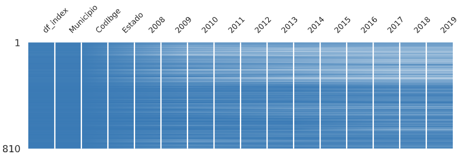
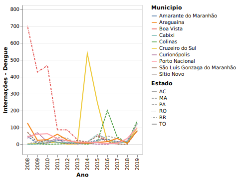
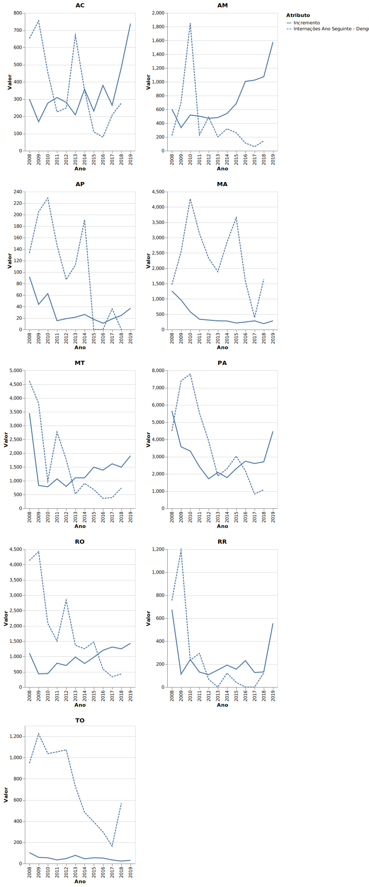
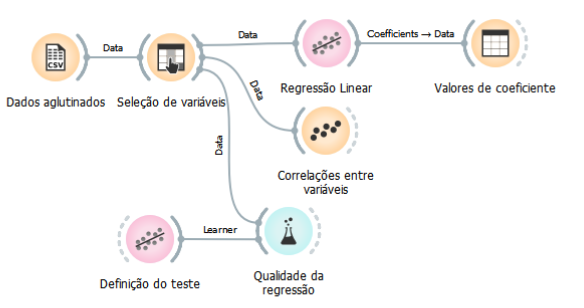
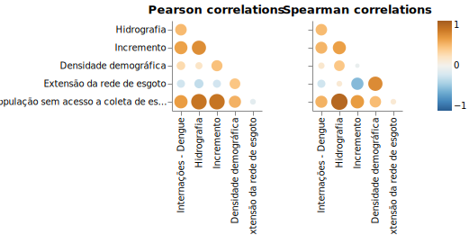

# Desmatamento e Doenças Emergentes: Novas Perspectivas dos Impactos Causados pela Exploração Ambiental em Zoonoses Emergentes
# Deforestation and Emerging Diseases: New Perspectives on the Impacts Caused by Environmental Exploitation in Emerging Zoonoses

# Apresentação

O presente projeto foi originado no contexto das atividades da disciplina de pós-graduação [*Ciência e Visualização de Dados em Saúde*](https://github.com/datasci4health/home), oferecida no primeiro semestre de 2021, na Unicamp.

# Equipe
| Nome                         | RA     | Especialização |
|------------------------------|--------|----------------|
| Bruna Moraes Lopes           | 216050 | Engenharia |
| George Corrêa de Araújo      | 191075 | Computação |
| Luidy Kazuo Issayama         | 136703 | Saúde |
| Stephanie Villa-Nova Pereira | 154410 | Saúde |

# Descrição Resumida do Projeto
A dengue é a doença causada por arbovírus de maior prevalência no Brasil. Isto representa um severo impacto negativo em índices socio-econômicos e de saúde dos brasileiros. Já se sabe a influência de fatores climáticos na dispersão e sobrevivência dos mosquitos vetores desta doença, entretanto, sua relação direta com o desmatamento não é bem esclarecida e os modelos atuais apontam uma correlação não significativa entre estas duas variáveis no estado do Amazonas. Como o desmatamento é um fator diretamente ligado a índices de urbanização, alterações climáticas e surgimento de doenças emergentes, a associação com o número de casos de dengue é intuitiva. Portanto, o objetivo deste trabalho é realizar análises de associação, regressões e médias de dados de internação e desmatamento da região da Amazônia Legal. Os dados foram filtrados para identificar os estados que ainda tinham área não desmatada e comparados entre os maiores e menores valores de incrementos de desmatamento. Como resultados preliminares, foi visto uma correlação elevada entre os dois fatores, com uma maior correlação das duas variáveis quando comparados os casos de internação do ano seguinte aos valores de desmatamento. Os modelos de regressão linear múltipla não foram satisfatórios para identificar influências de outras variáveis nos casos de internação, pois foram consideradas variáveis ou altamente correlacionadas, ou inversamente correlacionadas, o que não contribuíram para a construção de um modelo estatístico adequado. Por fim, os testes de hipóteses de comparações de médias (t-student) trouxeram uma perspectiva interessante quando comparadas as amostras dos municípios mais desmatados e menos desmatados, com uma diferença significativa entre alguns grupos.

# Vídeos do Projeto

## Vídeo da Proposta
> https://youtu.be/YkhxoM7QYJ0

## Vídeo da Apresentação Final
> Link para vídeo da apresentação final do projeto (máximo 8 minutos). *TODOS OS MEMBROS DO GRUPO DEVEM APARECER NO VÍDEO*.

# Slides do Projeto

## Slides da Proposta
> https://docs.google.com/presentation/d/1eRGl_2gjY-UMC1WCn4Dbgs2R6DZmlIVlSdykv4ebdTc/edit?usp=sharing

## Slides da Apresentação Final
> Link para slides da apresentação final do projeto.

# Introdução e Referenciais Teóricos
A dengue é uma doença infecciosa transmitida por mosquitos do gênero *Aedes* , principalmente pela espécie *Aedes aegypti*, e causada por arbovírus membros da família Flaviviridae, com quatro sorotipos diferentes: DENV-1, DENV-2, DENV-3 e DENV-4. Somente no Brasil, em 2019, foram registrados 1.544.987 casos de dengue, o que mostra que ainda é um fator de risco muito grande para a população [[1]](https://www.gov.br/pt-br/noticias/saude-e-vigilancia-sanitaria/2020/02/populacao-deve-ficar-atenta-a-proliferacao-do-aedes-aegypti-durante-periodo-chuvosa). Diferente de outras doenças tropicais negligenciadas, ela tem ganhado atenção mundial, devido a uma alta incidência - afetando 125 países e causando aproximadamente 100 milhões de casos sintomáticos por ano [[2]](https://www.nature.com/articles/nature12060) -, bem como um aumento na migração e adaptação dos vetores a climas temperados como Europa e América do Norte [[3]](https://journals.plos.org/plosntds/article?id=10.1371/journal.pntd.0007213). Além do clima ser um fator contribuinte para a migração e adaptação destes insetos, o desmatamento também é um fator de risco que promove a exposição de novos vírus e novas variantes de vírus aos seres humanos, já que a Amazônia é um dos maiores repositórios de arbovírus do mundo[[4]](https://pesquisa.bvsalud.org/portal/resource/pt/lil-188336).

O desmatamento é uma prática que consiste na retirada parcial ou total da cobertura vegetal de uma região. Na região amazônica, tem aumentado sucessivamente nos últimos 5 anos, alcançando as maiores taxas de desmatamento da década em 2020 [[5]](https://www.nature.com/articles/s41559-020-01368-x). Adicionalmente, de acordo com um relatório publicado pela Sociedade Vegetariana Brasileira, cerca de 70% da área desmatada na área da Amazônia é designada para a criação de gado  [[6]](https://www.cifor.org/publications/pdf_files/media/Amazon.pdf) [[7]](https://iopscience.iop.org/article/10.1088/1748-9326/5/2/024002/pdf). Estes fatores em conjunto podem ter uma grande contribuição no comportamento de migração, na proliferação e sobrevivência dos mosquitos, visto que influenciam na alteração climática e aquecimento global [[8]](https://wwf.panda.org/discover/knowledge_hub/where_we_work/amazon/amazon_threats/climate_change_amazon/?#:~:text=The%20changing%20nature%20of%20the,%2C%20agriculture%2C%20and%20human%20health)

Dado isso, estudar fatores influentes para o aumento de casos de dengue, nos auxilia a elaborar modelos estatítsticos mais precisos e mais preditivos de quando os surtos podem surgir, já que atualmente, os modelos existentes levam em consideração principalmete dados de temperatura e dados de saúde de baixa qualidade [[9]](https://pubmed.ncbi.nlm.nih.gov/25730702/). 
Portanto, o objetivo principal deste trabalho é compreender o impacto do desmatamento no aumento de número de casos de internação por dengue na região da Amazônia Legal - que apresenta os maiores índices de desmatamento do Brasil -, através de análises de correlações e testes de hipóteses com amostras estabelecidas a partir de critérios de desmatamento e internações. Foi levantado a possibilidade de utilização de modelos de regressão linear múltipla para investigar a influência de mais de uma váriavel nos aumentos de casos de internação. 

### Trabalhos relacionados
De uma maneira geral, a dengue é um assunto relativamente bem estudado e que apresenta alguns trabalhos de modelagem e previsão. Entretanto, como foi mencionado, os modelos não apresentam uma extensão próxima da realidade e muitas vezes são contraditórios entre si devido às diferentes abordagens, qualidade de dados de saúde e escolhas de variáveis, como mudanças climáticas e dados de acesso à saúde.

O primeiro trabalho com o objetivo de estudar os dados epidemiológicos da dengue com projeções matemáticas criou modelos simulatórios estocásticos com dados da literatura conhecidos à época que eram influentes para o desenvolvimento da doença. Para o modelo de transmissão da dengue, foram considerados os fatores climáticos que favoreciam o desenvolvimento do mosquito (vetor)[[10]](https://www.ajtmh.org/view/journals/tpmd/53/5/article-p489.xml). Em seguida, modelos mais complexos começaram a ser desenvolvidos, partindo dos mesmos modelos simulatórios e incrementando dados de alterações climáticas promovidas pelo aquecimento global, prevendo potenciais riscos de se tornarem epidemias mundiais, com o estabelecimento do mosquito em áreas que antes não tinham incidência. [[11]](https://www.ncbi.nlm.nih.gov/pmc/articles/PMC1533051/pdf/envhper00526-0073.pdf).

Quando se trata de modelagem para dengue, exitem duas abordagens principais: modelos mecanísticos e modelos estatísticos com base empírica. Os modelos mecanísticos são mais apropriados quando processos biológicos específicos relacionados com a transmissão do vírus em relação ao vetor e/ou hospedeiro estão bem descritos e bem parametrizados, como compreender o impacto de variáveis meteorológicas nas taxas de sobrevivência, competência como vetor viral, etc. Já os modelos estatísticos, por outro lado, são definidos porrelações empíricas entre localizações conhecidas de ocorrência do vírus e covariáveis implíticas hipotéticas e extrapolar essas relações a possíveis projeções futuras. [[12]](https://pubmed.ncbi.nlm.nih.gov/25730702/)

Para nossas análises, portanto, Optamos por utilizar modelos estatísticos para compreender os efeitos do desmatamento no número de internações de dengue.
Interessantemente, foi encontrado um artigo de 2021 que buscou compreender a influência do desmatamento, com abordagens bastante similares ao presente trabalho[[13]](https://www.ncbi.nlm.nih.gov/pmc/articles/PMC7790412/). No estudo, os modelos de regressão não encontraram uma relação entre o desmatamento e incidência de dengue e o acesso a saúde foi o único fator significativo para predizer a incidência. Entretanto, os critérios exploratórios dos bancos de dados podem ter sido pouco estudados. Nosso trabalho ampliou para todos os estados que fazem parte da Amazônia Legal e inserimos criterios de amostragem para obter respostas mais robustas com testes de hipóteses entre os anos e entre os estados de maior e menor incremento de desmatamento.

# Perguntas de Pesquisa
- O desmatamento contribui para o aumento de casos de dengue na região da Amazônia legal?
  - Existem outros fatores que podem contribuir para o aumento de casos de internações?
  - Existe diferença no número de casos de internações em estados com maiores e menores índices de desmatamento?

# Objetivos do Projeto

Nosso projeto propõe verificar se existe relação entre o aumento de desmatamento na Amazônia Legal e o aumento nos casos de internações por dengue.

# Metodologia

TODO: citar os caras que fizeram antes algo parecido

Para a realização deste trabalho os seguintes passos foram necessários:
- análise dos dados, interpretação e seleção de subconjuntos de interesse;
- limpeza e normalização dos dados;
- análise exploratória dos dados;
- análise de métodos de mineração de dados aplicáveis ao problema;
- realização de mineração de dados;
- avaliação e visualização dos resultados;
- publicação dos resultados obtidos.

O ciclo de análise dos dados à avaliação dos resultados poderá ser repetido diversas vezes, até o momento em que o conhecimento necessário para a resposta das perguntas de pesquisa seja obtido.

# Ferramentas

Durante o pré-processamento dos dados, assim como para a análise exploratória, foram utilizadas a linguagem [Python](https://www.python.org/) por meio do [Google Colab](https://colab.research.google.com/notebooks). Para a limpeza e tratamento dos dados foi utilizada a biblioteca [Pandas](https://pandas.pydata.org/), por facilitar o uso de dados tabulares, e durante sua exploração utilizamos também as bibliotecas [SciPy](https://www.scipy.org/) e [SKLearn](https://scikit-learn.org/). Estas bibliotecas possuem a implementação de várias técnicas estatísticas, como correlações e algoritmos de regressão linear. Para a visualização das informações utilizamos a biblioteca [python-tabulate](https://github.com/astanin/python-tabulate) para gerar tabelas e [Altair](https://altair-viz.github.io/) na geração de gráficos.

Já no processo de análises como teste de hipóteses e análise de correlações entre outras variáveis, várias outras ferramentas foram utilizadas, de modo que cada integrante utilizou a ferramenta que possuia maior domínio. Dentre essas variáveis estavam o [Orange](https://orangedatamining.com/) e a linguagem [R](https://www.r-project.org/), com o auxílios das bibliotecas [dplyr](https://dplyr.tidyverse.org/) para testes estatísticos e [ggplot2](https://ggplot2.tidyverse.org/) para realizar algumas visualizações.

## Bases de Dados e Evolução

Neste projeto trabalhamos com quatro bases de dados diferentes, sendo uma completamente descartada.

### Bases Estudadas mas Não Adotadas

| Base de Dados | Endereço na Web | Resumo |
| -- | -- | -- |
| Doenças e Agravos de Notificação | [DATASUS](http://www2.datasus.gov.br/DATASUS/index.php?area=0203&id=34523091&VObj=http://tabnet.datasus.gov.br/cgi/deftohtm.exe?sinannet/cnv/dengueb) | Para o número de notificações, são incluídas notificações de indivíduos residentes no Brasil, independente de sua confirmação, exceto os descartados, pois em situações de epidemia nem sempre é possível confirmar todos os casos. |

#### Obtenção das Bases

O número de notificações foi obtido a partir da filtragem dos dados epidemiológicos e morbidade do TABNET (Doenças e Agravos de Notificação - 2007 em diante (SINAN). Após a seleção `Dengue até 2013` ou `Dengue de 2014 em diante` por estado, foram separados os filtros com todos os períodos disponíveis: Linha - `município de residência`; Coluna - `mês o primeiro sintoma`; Conteúdo - `Casos prováveis`.

#### Pré-Processamento e Análise Inicial

As informações de doenças e agravos de notificação possuem informações sobre várias doenças, porém para este trabalho focamos nas informações sobre a dengue. Mais especificamente, selecionamos os dados de notificação do primeiro sintoma de dengue, agupados por mês/ano. Toda a análise feita nesses dados pode ser visualizada em um [notebook](notebooks/Pr%C3%A9_Processamento_Dados_de_Doen%C3%A7as.ipynb) ou [colab](https://colab.research.google.com/drive/1rdaYe6WFL_gSABGVkmvFvD-s-gs1THQK?usp=sharing).

Durante o carregamento dos dados, várias etapas de limpeza e adequação foram necessárias. Primeiramente foram removidas a linha e coluna que contém a soma (`Total`) e a coluna `Ign/Em Branco`, quando presente. Em seguida, criamos a coluna `Estado` com a respectiva informação e dividimos a coluna referente ao município em duas colunas: `Municipio` e `CodIbge`. Posteriormente, substituímos os valores `-` por `0`, visto que seus valores eram computados como 0 na linha e coluna `Total`.

Analisando individualmente os anos para o mesmo estado, percebemos variação na quantidade de municípios, o que indica que nem todos os municípios possuem informações de todos os anos. Para adicionar esses dados na tabela como dados faltantes (`NaN`), criamos uma lista composta por todos os municípios daquele estado que possuem informação em algum dos anos. A partir dessa lista adicionamos o nome daquele município em todos os anos, preenchendo os valores com `NaN` quando não anteriormente presente, de modo que a informação daquele estado para todos os anos possuam a mesma quantidade de municípios.

Como os dados de desmatamento possuem granularidade anual, aglutinamos as informações por ano, de modo a gerar uma tabela por estado, com informações anuais de cada município daquele estado. Num passo final, agregamos todas as tabelas em uma única, contendo todos os municípios de todos os estados, com informações anuais de notificação do primeiro sintoma de dengue.

Durante uma análise exploratória inicial, percebemos a grande quantidade de dados faltantes, chegando a ser, em algumas colunas, mais de 30% dos valores. De 810 municípios contidos nos dados, 272 deles (33.6%) não possuem informação sobre notificações para o ano de 2018, por exemplo. Uma análise visual dos valores faltantes pode ser observado nas figuras abaixo.

Para verificar o real impacto dos dados faltantes, optamos por comparar a quantidade de municípios total e a quantidade de municípios com todas as informações completas, agrupados por estado. Através da tabela abaixo, podemos verificar que a maior parte dos municípios possui alguma informação faltante. De 810 municípios, somente 297 possuem informações para todo o período de 2008 a 2019. Há estados que possuem uma quantidade muito pequena de dados completos, como o Amapá e o Amazonas, e estados que inclusive não possuem informação total de nenhuma cidade, como é o caso de Roraima. Devido à quantidade reduzida de dados completos, optamos por descartar essa base de dados.

| Estado   |   Total de Municípios |   Municípios Completos |
|----------|-----------------------|------------------------|
| AC       |                    22 |                     10 |
| AP       |                    17 |                      4 |
| AM       |                    62 |                      8 |
| MA       |                   217 |                     39 |
| MT       |                   142 |                     84 |
| PA       |                   142 |                     71 |
| RO       |                    53 |                     28 |
| RR       |                    15 |                      0 |
| TO       |                   140 |                     53 |
| Total    |                   810 |                    297 |

### Bases Estudadas e Adotadas

| Base de Dados | Endereço na Web | Resumo |
| -- | -- | -- |
| Desmatamento nos Municípios da Amazônia Legal | [PRODES Amazônia](http://www.dpi.inpe.br/prodesdigital/prodesmunicipal.php) | A estimativa de extensão desmatada por município baseia-se no cálculo do desmatamento acumulado e observado até 2019 dentro dos limites administrativos  dos municípios que fazem parte da Amazônia Legal. Além da classe com a extensão desflorestada, as áreas de outras classes de cobertura da terra  e nuvem, foram calculadas  para cada ano de análise como: floresta, nuvem, não floresta, hidrografia e área não observada. |
| Indicadores de Saneamento | [Painel Saneamento Brasil](https://www.painelsaneamento.org.br/explore/ano) | Possui indicadores de saneamento ligados a saúde e renda, educação, valorização imobiliária, impactos ao turismo, entre outros, dos 839 municípios com população acima de 50 mil habitantes. |
| Morbidade Hospitalar do SUS | [DATASUS](http://www2.datasus.gov.br/DATASUS/index.php?area=0203&id=6927&VObj=http://tabnet.datasus.gov.br/cgi/deftohtm.exe?sih/cnv/nr) | O número de internações por dengue representa todos os casos registrados e confirmados no período, separados por mês, ano de notificação e município que registrou o caso. |

#### Obtenção das Bases

Os dados de desmatamento foram obtidos a partir da seleção dos dados no sistema da PRODES. Para tal, é necessário selecionar na opção `Estado/Região` a Amazônia Legal, alterando o ano entre 2008 a 2019. Após esse passo, geramos a lista, e ao fim da mesma há a opção `Gera arquivo .txt`.

Já os indicadores de saneamento foram filtrados por ano. Foi selecionada a opção `editar` e, em seguida, selecionados vários indicadores. Devido a limitações do sistema, foram selecionados oito indicadores por vez, sendo criados dessa forma cinco grupos de indicadores diferentes. Após esse passo foram filtradas manualmente as localidades cuja classificação é acima de município, como por exemplo região metropolitana e estado.

O número de internações foi obtido a partir da filtragem dos dados epidemiológicos e morbidade do TABNET. Após a seleção `geral, por local de residência - a partir de 2008` por estado, foram separados os filtros com todos os períodos disponíveis: Linha - `municípios`; Coluna - `Ano/mês de atendimento`; Conteúdo - `internações`. Por fim, nas seleções, foi selecionado `Dengue` na `Lista Morb CID-10`, para filtrar apenas os casos de Dengue.

#### Pré-Processamento e Análise Inicial

O pré-processamento dos dados de desmatamento exigiu poucos passos, visto a completude e qualidade dos dados disponibilizados. Os passos necessários foram somente carregar os dados utilizando a codificação correta (`latin`) devido aos caracteres especiais e descartar as colunas `Latgms`, `Longms` e `CodIbge`. A coluna `CodIbge` foi descartada após avaliarmos que o código do IBGE contido nos dados de desmatamento possui um dígito a mais que o mesmo código nos dados de internação, gerando discrepâncias. Após esses passos, unimos a informação de todos os anos em uma única tabela.

Como um passo adicional, optamos por adicionar a informação de percentual de área desmatada até aquele ano. Geramos quatro versões dos dados de desmatamento: uma versão com informações por município ([dados_desmatamento.csv](data/processed/dados_desmatamento.csv)), uma versão com informações agrupadas por estado ([dados_desmatamento_estado.csv](data/processed/dados_desmatamento_estado.csv)), e uma versão destes dois dados com uma coluna extra `Ano` ([dados_desmatamento_col_ano.csv](data/processed/dados_desmatamento_col_ano.csv) e [dados_desmatamento_estado_col_ano.csv](data/processed/dados_desmatamento_estado_col_ano.csv)), de modo a facilitar a geração de gráficos com informações temporais. Todo o processo de pré-processamento dos dados de desmatamento pode ser replicado neste [notebook](notebooks/Pr%C3%A9_Processamento_Dados_de_Desmatamento.ipynb) ou [colab](https://colab.research.google.com/drive/1AsiwT2YpcR69EVzump4aTx-ZVmwZ_gA8?usp=sharing).

Inicialmente, com os dados hospitalares, havíamos decidido utilizar informações sobre quatro doenças: dengue, dengue hemorrágica, febre amarela e raiva, considerando todos os nove estados que compõem a Amazônia Legal. As informações referentes a cada doença que buscamos foram: internações, óbitos, taxa de mortalidade e valor gasto. O pré-processamento realizado pode ser verificado neste [notebook](notebooks/Pr%C3%A9_Processamento_Dados_Hospitalares.ipynb) ou neste [colab](https://colab.research.google.com/drive/1KlttoMcMMMOPWFxvCS6Z_nQh6D6_TL18?usp=sharing).

O primeiro passo ao carregar os dados foi descartar a última linha e coluna, referente ao valor total. Foi criada a coluna `Estado` com a devida informação e as colunas `Municipio` e `CodIbge` a partir das informações do município contidas na tabela. Os valores `-` foram substituídos por `0`, por serem computados desta forma na linha/coluna total. Um próximo passo foi padronizar os dados, adicionando informações dos municípios faltantes em cada ano, de modo que as informações anuais dos estados possuam a mesma quantidade de municípios. Desta forma, foi possível aglutinar as informações por estado, e posteriormente em uma única tabela.

Ao analisarmos a completude dos dados, decidimos por focar nossos estudos na dengue, mais especificamente nos dados de internações por dengue. De 114.480 linhas em nossa tabela, que envolvem informações sobre todos os municípios para cada mês, somente `Internações` e `Valor Gasto` possuem uma porcentagem pequena de dados faltantes. Uma tabela com maiores informações sobre as colunas analisadas, assim como uma figura demonstrando visualmente a completude dos dados, podem ser visualizadas abaixo.

| Doença             | Informação          |   Dados faltantes |   % dados faltantes |
|--------------------|---------------------|-------------------|---------------------|
| Dengue             | Internações         |               765 |                0.67 |
|                    | Óbitos              |            110576 |               96.59 |
|                    | Taxa de Mortalidade |            110576 |               96.59 |
|                    | Valor Gasto         |               765 |                0.67 |
| Dengue_hemorragica | Internações         |             65645 |               57.34 |
|                    | Óbitos              |            110307 |               96.35 |
|                    | Taxa de Mortalidade |            110307 |               96.35 |
|                    | Valor Gasto         |             65645 |               57.34 |
| Febre_amarela      | Internações         |            114050 |               99.62 |
|                    | Óbitos              |            114345 |               99.88 |
| Raiva              | Internações         |            114296 |               99.84 |
|                    | Óbitos              |            114423 |               99.95 |
| Febre_amarela      | Taxa de Mortalidade |            114477 |              100    |
|                    | Valor Gasto         |            114182 |               99.74 |
| Raiva              | Taxa de Mortalidade |            114472 |               99.99 |
|                    | Valor Gasto         |            114345 |               99.88 |

Após descartarmos as colunas referentes às outras doenças e dados hospitalares, agrupamos as informações mensais por ano. Geramos novamente quatro versões dos dados: uma versão com informações por município ([dengue_internacoes.csv](data/processed/dengue_internacoes.csv)), uma versão com informações agrupadas por estado ([dengue_internacoes_estado.csv](data/processed/dengue_internacoes_estado.csv)), e uma versão destes dois dados com uma coluna extra `Ano` ([dengue_internacoes_col_ano.csv](data/processed/dengue_internacoes_col_ano.csv) e [dengue_internacoes_estado_col_ano.csv](data/processed/dengue_internacoes_estado_col_ano.csv)), de modo a facilitar a geração de gráficos com informações temporais.

Ao decidirmos por avaliar a utilização dos dados de sanemanento, partimos inicialmente dos dados integrados entre desmatamento e internações por dengue, que será introduzido no próximo tópico. Desta forma, filtramos somente os municípios já anteriormente contemplados nos dados integrados. Partimos inicialmente de cinco grupos de indicadores, realizando alguns passos de limpeza. Removemos o código IBGE dos municípios, filtramos para manter somente os municípios de interesse, removemos alguns símbolos (como `%` e `.`) e substituímos o indicador de casa decimal por `.`, pois é o padrão utilizado na biblioteca que usamos.

Posteriormente unimos os grupos, selecionando somente alguns atributos que consideramos mais interessantes, exibidos na tabela abaixo. Adicionamos esses atributos aos dados integrados de desmatamento e internações que possuem a coluna `Ano`, removendo os municípios que possuem dados faltantes. Aplicamos a esses dados o mesmo filtro que decidimos usar para o teste de hipóteses: são removidos primeiramente todos os municípios que possuem mais que 60% de sua área total desmatada em 2008 ou que estão completamente desmatados em 2018. Estes dados foram salvos em dois formatos, um com informações por município ([desmat_dengue_san.csv](data/processed/desmat_dengue_san.csv)) e outro com informações agrupadas por estado ([desmat_dengue_san_estado.csv](data/processed/desmat_dengue_san_estado.csv)). Estes dados foram utilizados para fazer uma regressão linear multivariável, com o objetivo de descobrir a influência de outras variáveis no aumento do número de internações de dengue.

| Atributo |
| --- |
| População total que mora em domicílios sem acesso ao serviço de coleta de esgoto (pessoas) (SNIS) |
| Parcela da população total que mora em domicílios sem acesso ao serviço de coleta de esgoto (% da população) (SNIS) |
| Extensão da rede de distribuição de esgoto, em km (km) (SNIS) |
| Densidade demográfica (pessoas por km²) (Pessoas por km²) (IBGE) |

### Integração entre Bases e Análise Exploratória

Optamos por realizar inicialmente uma análise exploratória nas bases individualmente e, somente depois, integrar os dados em uma única base e realizar sua análise. 

#### Análise Exploratória nas Bases Individualmente

##### Dados de Desmatamento

A análise exploratória dos dados de desmatamento foi realizada em um [notebook](notebooks/An%C3%A1lise_Explorat%C3%B3ria_Dados_de_Desmatamento.ipynb), através deste [colab](https://colab.research.google.com/drive/1k_sxTnaW0MPt5iabXZYrFfRBmn2js4AI?usp=sharing). Iniciamos sua análise verificando a completude dos dados. Podemos verificar por meio da tabela abaixo que os dados de desmatamento não possuem nenhum dado faltante.

| Coluna        |   Dados Faltantes |
|---------------|-------------------|
| Lat           |                 0 |
| Long          |                 0 |
| Municipio     |                 0 |
| Estado        |                 0 |
| AreaKm2       |                 0 |
| Ano           |                 0 |
| Desmatado     |                 0 |
| Incremento    |                 0 |
| Floresta      |                 0 |
| NaoFloresta   |                 0 |
| Hidrografia   |                 0 |
| PercDesmatado |                 0 |

Analisamos também o incremento de desmatamento anual de cada estado. Para todos os anos, o Pará foi o estado com maior acréscimo de área desmatada. Essa informação fica clara ao analisarmos a figura abaixo. Podemos perceber que houve, principalmente nos estados de Mato Grosso e Pará, uma redução significativa no incremento da área desmatada. Isso se deve, provavelmente, ao aumento da fiscalização ambiental que ocorreu nos anos do governo [Lula](https://observatorio-eco.jusbrasil.com.br/noticias/2520623/legislacao-ambiental-do-governo-lula). Posteriormente, no governo [Dilma](https://www.bbc.com/portuguese/brasil-49683787), houve uma flexibilização da política ambiental, o que levou novamente ao crescimento do desmatamento.

Ao avaliarmos a maior área desmatada total, percebemos que os estados com maior área desmatada são: Pará, Mato Grosso, Maranhão e Rondônia, como podemos observar na imagem abaixo. Eles compõem a borda externa da Amazônia Legal, indicando que a Amazônia está sendo mais desmatada de fora para dentro. Para avaliar o crescimento de uma outra forma, optamos por realizar uma regressão linear da área desmatada por estado ao longo dos anos, focando principalmente no coeficiente da regressão. 

Todos os estados apresentaram correlação positiva e com alto grau de confiança. Avaliando os coeficientes fica claro que o Pará e Mato Grosso seguem sendo desmatados com maior velocidade, mas chama a atenção o fato de o terceiro da lista ser Rondônia, seguido pelo Amazonas, indicando que o desmatamento no Amazonas cresce a uma taxa maior que a no Maranhão.

| Estado   |   Coeficiente |
|----------|---------------|
| PA       |     2468.57   |
| MT       |     1217.52   |
| RO       |      936.028  |
| AM       |      720.816  |
| MA       |      317.681  |
| AC       |      314.372  |
| RR       |      175.075  |
| TO       |       48.7031 |
| AP       |       25.7098 |

Apesar do decréscimo no incremento da área desmatada que houve de 2008 a 2012, podemos perceber que a média e 3o quartil das caixas foram crescendo a partir de 2012, indicando a tendência forte no aumento do desmatamento que se sucedeu nestes anos. A partir de 2015 o número de elementos acima da mediana aumentou consideravelmente em relação ao 1o quartil, indicando que a maior parte dos valores estão acima da mediana daquele período.

Quanto aos municípios, [São Félix do Xingu](https://earth.google.com/web/@-6.79676284,-51.8369192,256.38213797a,281025.34688607d,35y,6.99026636h,0t,0r/data=CjISMBIgNTQ0MGExNzMxYzI1MTFlYTk0NDM4YmI2ODk0NDUyOTciDG1haW5Ob1JhbmRvbQ) (PA), [Porto Velho](https://earth.google.com/web/@-8.7611605,-63.90043028,94.00000864a,49760.98087303d,35y,7h,0t,0r/data=CjISMBIgNTQ0MGExNzMxYzI1MTFlYTk0NDM4YmI2ODk0NDUyOTciDG1haW5Ob1JhbmRvbQ) (RO) e [Altamira](https://earth.google.com/web/@-3.22960653,-52.1569634,122.49219257a,61809.78760075d,35y,6.99690431h,0t,0r/data=CjISMBIgNTQ0MGExNzMxYzI1MTFlYTk0NDM4YmI2ODk0NDUyOTciDG1haW5Ob1JhbmRvbQ) (PA) foram os mais afetados por desmatamento no período de 2008 a 2019. O efeito do desmatamento nessas regiões pode ser visto por meio dos links relacionados aos mesmos, e um resumo dos seus incrementos é mostrado na tabela abaixo.

| Período   | Município          | Estado   |   Área (km2) |
|-----------|--------------------|----------|--------------|
| 2007/2008 | São Félix do Xingu | PA       |        765.1 |
| 2008/2009 | São Félix do Xingu | PA       |        444.4 |
| 2009/2010 | São Félix do Xingu | PA       |        353.7 |
| 2010/2011 | Porto Velho        | RO       |        324.9 |
| 2011/2012 | Altamira           | PA       |        229.9 |
| 2012/2013 | Porto Velho        | RO       |        315.6 |
| 2013/2014 | Altamira           | PA       |        293.9 |
| 2014/2015 | Altamira           | PA       |        308.6 |
| 2015/2016 | Altamira           | PA       |        409.5 |
| 2016/2017 | Porto Velho        | RO       |        353.4 |
| 2017/2018 | Altamira           | PA       |        435   |
| 2018/2019 | Altamira           | PA       |        575.4 |

Apesar de nos anos seguintes São Félix do Xingu não ter sido o município com maior incremento de área desmatada, ele seguiu sendo o município com maior área total desmatada. Ele é conhecido como a [capital do desmatamento na Amazônia](https://www.dw.com/pt-br/a-capital-do-desmatamento-na-amaz%C3%B4nia/a-52243986). Ao total 27 municípios diferentes estiveram entre os 10 municípios com maior incremento de desmatamento entre 2008 e 2019. Destes, a maior parte se encontra no Pará, seguidos por Mato Grosso e Amazonas.

| Estado   |   Qtde de Municípios |
|----------|----------------------|
| AM       |                    3 |
| MA       |                    2 |
| MT       |                    4 |
| PA       |                   15 |
| RO       |                    2 |
| RR       |                    1 |

##### Dados Hospitalares

A análise exploratória dos dados hospitalares, assim como os de desmatamento, foi realizada em um [notebook](notebooks/An%C3%A1lise_Explorat%C3%B3ria_Dados_Hospitalares.ipynb), através deste [colab](https://colab.research.google.com/drive/1KlttoMcMMMOPWFxvCS6Z_nQh6D6_TL18?usp=sharing). Iniciamos sua análise verificando a completude dos dados. Podemos verificar por meio da tabela abaixo que todos os anos possuem dados faltantes.

| Coluna    |   Dados Faltantes |
|-----------|-------------------|
| Municipio |                 0 |
| CodIbge   |                 0 |
| Estado    |                 0 |
| 2008      |                 4 |
| 2009      |                 4 |
| 2010      |                 4 |
| 2011      |                 4 |
| 2012      |                 4 |
| 2013      |                 4 |
| 2014      |                19 |
| 2015      |                 4 |
| 2016      |                18 |
| 2017      |                33 |
| 2018      |                19 |
| 2019      |                18 |

Verificando os dados faltantes por estado, podemos observar que a maior parte dos dados faltantes se concentram em somente dois estados: Amapá e Roraima.

| Estado | 2008 | 2009 | 2010 | 2011 | 2012 | 2013 | 2014 | 2015 | 2016 | 2017 | 2018 | 2019 |
| --- | --- | --- | --- | --- | --- | --- | --- | --- | --- | --- | --- | --- |
| AC | 0 | 0 | 0 | 0 | 0 | 0 | 0 | 0 | 0 | 0 | 0 | 0 |
| AP | 0 | 0 | 0 | 0 | 0 | 0 | 0 | 0 | 14 | 14 | 0 | 14 |
| AM | 1 | 1 | 1 | 1 | 1 | 1 | 1 | 1 | 1 | 1 | 1 | 1 |
| MA | 0 | 0 | 0 | 0 | 0 | 0 | 0 | 0 | 0 | 0 | 0 | 0 |
| MT | 1 | 1 | 1 | 1 | 1 | 1 | 1 | 1 | 1 | 1 | 1 | 1 |
| PA | 1 | 1 | 1 | 1 | 1 | 1 | 1 | 1 | 1 | 1 | 1 | 1 |
| RO | 0 | 0 | 0 | 0 | 0 | 0 | 0 | 0 | 0 | 0 | 0 | 0 |
| RR | 0 | 0 | 0 | 0 | 0 | 0 | 15 | 0 | 0 | 15 | 15 | 0 |
| TO | 1 | 1 | 1 | 1 | 1 | 1 | 1 | 1 | 1 | 1 | 1 | 1 |

Para todos os anos os estados com o maior número de internações foram o Pará e posteriormente o Maranhão. Podemos observar analisando o gráfico abaixo que há uma tendência à diminuição do número de internações por casos de dengue no período de 2008 a 2018 em todos os estados. Em 2019 houve um aumento em relação a 2018 para todos os estados, com exceção do Amapá.

Foi realizada outra análise em relação aos municípios com maior número de internações por dengue anualmente. Esses valores estão representados na tabela a seguir

Município com maior número de internações

|   Ano | Município       | Estado   |   Internações |
|-------|-----------------|----------|---------------|
|  2008 | Manaus          | AM       |           804 |
|  2009 | Várzea Grande   | MT       |          1112 |
|  2010 | Ananindeua      | PA       |           709 |
|  2011 | Manaus          | AM       |          1631 |
|  2012 | Ananindeua      | PA       |           459 |
|  2013 | Ji-Paraná       | RO       |           547 |
|  2014 | Cruzeiro do Sul | AC       |           539 |
|  2015 | Cruzeiro do Sul | AC       |           249 |
|  2016 | Ji-Paraná       | RO       |           306 |
|  2017 | Aldeias Altas   | MA       |           208 |
|  2018 | Augusto Corrêa  | PA       |            91 |
|  2019 | Colinas         | MA       |           140 |

Como podemos perceber, tirando os anos de 2008 e 2011, em que o município com maior número de casos foi uma capital (Manaus) que possui população elevada, para todos os outros anos os municípios com maior número de internações foram municípios do interior, com provável acesso menor da população a serviços de conscientização e atenção à saúde. Para confirmar tal hipótese será necessário acesso a dados de investimento em conscientização e saneamento básico.

Outra análise relevante, é que uma variação muito grande dos valores de internações nos municípios de Boa Vista (RR), Cruzeiro do Sul (AC) e Colinas (MA). No caso de Boa Vista, pelo fato de a mudança ter acontecido e a redução ter sido constante, é provável que seja fruto de ações de conscientização e investimento em saúde na região. Nos casos de Cruzeiro do Sul e Colinas, pelo fato de serem valores muito diferentes dos anos anteriores e posteriores, pode ser possível haver erros nos dados ou mesmo um surto de casos. Essas variações podem ser verificadas a partir do gráfico abaixo

Nos boxplots abaixo está representado o agrupamento de todos os estados por ano, onde podemos observar que nos anos de 2009 a 2013 tivemos uma maior quantidade de internações por dengue, o que está representado tanto pela mediana das caixas como pelos 1o e 3o quartis. Após esse período podemos perceber uma tendência à redução do número de casos, levando a redução tanto da mediana quando dos quartis das caixas, o que não se manteve para o ano de 2019.

#### Integração entre Bases

Após analisarmos isoladamente as bases de dados, unificamos os dados de desmatamento e internações por dengue em uma única tabela, de modo a facilitar as análises seguintes. Esse processo está contemplado neste [notebook](notebooks/Pr%C3%A9_Processamento_Juntando_os_Dados.ipynb) e neste [colab](https://colab.research.google.com/drive/18oavHEsIHY5DL5jOx7EKZ4v4irqnEjHj?usp=sharing). Para integrar os dados, precisamos primeiramente alinhar os municípios, ou seja, garantir que ambos os dados possuem os mesmos municípios. Dessa forma, verificamos que, além de os dados não possuírem o mesmo número de municípios, os dados de desmatamento possuiam municípios supostamente repetidos.

| Dados | Qtde Municípios | Qtde Municípios Únicos (nome) |
| --- | --- | --- |
| Desmatamento | 760 | 755 |
| Hospitalar | 790 | 790 |

Para certificarmos de que não há municípios repetidos, decidimos buscar por municípios de mesmo nome e mostrar algumas de suas características, que podem ser verificadas na tabela abaixo. Os dados de desmatamento possuem 5 pares de municípios com o mesmo nome, porém pertencentes a estados diferentes. Alguns deles, como Pau D'Arco, possuem valores de latitude e longitude muito próximos, indicando possivelmente cidades na fronteira entre os estados.

|       Lat |     Long | Municipio              | Estado   |
|-----------|----------|------------------------|----------|
|  -9.99527 | -68.1593 | Rio Branco             | AC       |
| -15.2814  | -58.1518 | Rio Branco             | MT       |
| -11.1937  | -61.8474 | Presidente Médici      | RO       |
|  -2.30799 | -45.7641 | Presidente Médici      | MA       |
|  -7.72486 | -50.1341 | Pau D'Arco             | PA       |
|  -7.55219 | -48.9966 | Pau D'Arco             | TO       |
|  -5.02798 | -48.7711 | Bom Jesus do Tocantins | PA       |
|  -9.00182 | -47.8631 | Bom Jesus do Tocantins | TO       |
|  -6.73568 | -48.5563 | Araguanã               | TO       |
|  -3.06101 | -45.7722 | Araguanã               | MA       |

O processo de alinhamento dos municípios envolve remover de ambos os dados informações dos municípios que não constam no outro. Dessa forma, terminamos com informações sobre 740 municípios dos 9 estados que compõem a Amazônia Legal. Geramos quatro versões dos dados: uma versão com informações por município ([dados_conjuntos.csv](data/processed/dados_conjuntos.csv)), uma versão com informações agrupadas por estado ([dados_conjuntos_estado.csv](data/processed/dados_conjuntos_estado.csv)), e uma versão destes dois dados com uma coluna extra `Ano` ([dados_conjuntos_col_ano.csv](data/processed/dados_conjuntos_col_ano.csv) e [dados_conjuntos_estado_col_ano.csv](data/processed/dados_conjuntos_estado_col_ano.csv)), de modo a facilitar a geração de gráficos com informações temporais. Ainda nos dados com a coluna `Ano`, criamos uma coluna chamada `Internações Ano Seguinte - Dengue`, contendo as informações referentes a internações do próximo ano, de modo a facilitar a análise da influência do desmatamento nos casos de dengue no próximo ano.

#### Análise Exploratória na Base Integrada

Após unificarmos as bases, realizamos uma análise da mesma, iniciando dos dados faltantes. Estas análises podem ser visualizadas no [notebook](notebooks/An%C3%A1lise_Explorat%C3%B3ria_Dados_Conjuntos.ipynb) e [colab](https://colab.research.google.com/drive/1UKLckgEir1nVk5HG_beE4if4JnwhHsd8?usp=sharing) correspondentes. Por meio dessa análise, pudemos perceber que os estados do Amapá e Roraima possuem dados faltantes de internação em todos os seus municípios em alguns anos, inutilizando seus usos.

| Estado   |   Qtde Municípios |   2008 |   2009 |   2010 |   2011 |   2012 |   2013 |   2014 |   2015 |   2016 |   2017 |   2018 |   2019 |
|----------|-------------------|--------|--------|--------|--------|--------|--------|--------|--------|--------|--------|--------|--------|
| AC       |                22 |      0 |      0 |      0 |      0 |      0 |      0 |      0 |      0 |      0 |      0 |      0 |      0 |
| AM       |                54 |      1 |      1 |      1 |      1 |      1 |      1 |      1 |      1 |      1 |      1 |      1 |      1 |
| AP       |                14 |      0 |      0 |      0 |      0 |      0 |      0 |      0 |      0 |     14 |     14 |      0 |     14 |
| MA       |               169 |      0 |      0 |      0 |      0 |      0 |      0 |      0 |      0 |      0 |      0 |      0 |      0 |
| MT       |               140 |      1 |      1 |      1 |      1 |      1 |      1 |      1 |      1 |      1 |      1 |      1 |      1 |
| PA       |               141 |      1 |      1 |      1 |      1 |      1 |      1 |      1 |      1 |      1 |      1 |      1 |      1 |
| RO       |                51 |      0 |      0 |      0 |      0 |      0 |      0 |      0 |      0 |      0 |      0 |      0 |      0 |
| RR       |                15 |      0 |      0 |      0 |      0 |      0 |      0 |     15 |      0 |      0 |     15 |     15 |      0 |
| TO       |               134 |      1 |      1 |      1 |      1 |      1 |      1 |      1 |      1 |      1 |      1 |      1 |      1 |

Procuramos também visualizar a possível influência direta do incremento do desmatamento em um determinado estado e o aumento nos casos de internação por dengue, tanto no mesmo ano quanto no ano seguinte. Uma análise geral dos gráficos mostram que não há uma possível correlação direta entre incremento da área desmatada e aumento de internações por dengue. Estamos cientes de que vários outros fatores podem influenciar os resultados, permeando entre tamanho da população, acesso a saneamento básico e informações, nível de escolaridade médio, entre outros. Uma possibilidade futura é investigar o possível uso de novos atributos, de modo a verificar a influência de múltiplas variáveis.

Buscamos ainda aprender um pouco mais sobre os municípios que apresentam o menor incremento na área desmatada e percebemos que, além da possibilidade do desmatamento ter cessado em determinada região, outro possível fator para um município ter incremento zero de área desmatada é caso toda sua área já tenha sido desmatada. Isso se mostrou verdade para alguns municípios, sendo todos do Maranhão, como podemos observar na tabela a seguir.

| Estado   | Município              |   Área (km2) |   Área Desmatada em 2008 (km2) |
|----------|------------------------|--------------|--------------------------------|
| MA       | Altamira do Maranhão   |          542 |                          542.5 |
| MA       | Bom Lugar              |          451 |                          451.8 |
| MA       | Brejo de Areia         |          365 |                          365.1 |
| MA       | Igarapé Grande         |          379 |                          380   |
| MA       | Lago da Pedra          |         1552 |                         1552   |
| MA       | Lago do Junco          |          312 |                          312.4 |
| MA       | Lago dos Rodrigues     |          196 |                          196.8 |
| MA       | Olho d'Água das Cunhãs |          704 |                          704.6 |
| MA       | Paulo Ramos            |         1063 |                         1064   |
| MA       | São Roberto            |          229 |                          229.7 |

De fato, alguns municípios já iniciam o ano de 2008 com sua área completamente desmatada, de acordo com os dados. Para análises futuras, decidimos utilizar um filtro para descartar esses dados. O filtro é feito da seguinte forma: são removidos primeiramente todos os municípios que possuem mais que 60% de sua área total desmatada em 2008 ou que estão completamente desmatados em 2018; e posteriormente são selecionados somente os 10 municípios que mais sofreram e os 10 que menos sofreram desmatamento entre 2008 e 2019. A verificação de quanto desmatamento um município sofreu é feita a partir da diferença de área desmatada total entre o último e primeiro ano da análise. O grupo formado pelos 10 municípios que mais sofreram desmatamento e os 10 que menos sofreram foi utilizado durante o teste de hipóteses. Uma visualização em mapa do incremento de desmatamento e casos de internação no mesmo ano é exibida a seguir.

# Análises Realizadas

A partir da ferramenta Orange utilizamos a regressão linear múltipla para observar se algumas variáveis dentro do banco de dados influenciam de algum modo a taxa de internações de dengue ao longo dos anos. Para tal análise, foram escolhidas como variáveis independentes (variáveis de entrada) a população total que mora em domicílios sem acesso ao serviço de coleta de esgoto, incremento de desmatamento entre o ano atual e o anterior, extensão da rede de distribuição de esgoto, população total que mora em domicílios sem acesso ao serviço de coleta de esgoto, densidade demográfica e área de hidrografia. Para a variável dependente (variável de saída) escolhemos o número de internações por dengue nos anos de 2008 até 2019. O fluxograma para a análise está representado a seguir.

Antes da realização da regressão linear múltipla foi averiguado a correlação entre todas as variáveis a partir do coeficiente de Pearson. Essa análise consiste em definir se várias variáveis se influenciam em relação à outra, e como é codificada essa influência. Se as variáveis se influenciam, haverá um tipo de correlação, podendo ser positiva ou negativa. Se a variável for correlacionada ela estará mais próxima do valor 1 (1º e 3º quadrante do eixo). Caso o valor do coeficiente estiver mais próximo de -1 significa que as variáveis são anti-correlacionadas (2º e 4º quadrantes do eixo).  Foi calculado, também, o p-valor para cada conjunto de variáveis relacionadas para verificar o grau de certeza da correlação. Outra análise realizada, é calcular o coeficiente de Spearman. Esse coeficiente avalia a relação monotônica entre duas variáveis contínuas ou ordinais. Em uma relação monotônica, as variáveis tendem a mudar juntas mas não necessariamente a uma taxa constante. E enquanto a correlação de Pearson mede relações lineares, a de Spearman mede apenas relações monotônicas (lineares ou não lineares). Por conta disso, serão calculados os dois tipos de coeficientes com os respectivos p-valores.

A partir de testes estatísticos de hipótese é possível inferir, dentro de um certo nível de confiança e baseado dados amostrais, se a média visualizada nas amostras estudadas pode ser extrapolada para a média da população de onde as amostras foram retiradas. Os testes estatísticos não impedem o erro, mas calculam a probabilidade desse erro ocorrer na pesquisa, auxiliando na tomada de decisão.

De forma geral, tais testes podem ser divididos entre testes paramétricos e não paramétricos, de acordo com as premissas de distribuição de freqüências amostrais, homogeneidade de variâncias, homogeneidade do N entre os grupos e erros independentes. Testes paramétricos possuem forte indicação para casos em que as amostras possuem distribuição homogênea/ normal, enquanto os testes não-paramétricos não possuem essa exigência.

Apesar da premissa acerca da normalidade da distribuição, o cumprimento de algumas outras condições em situações de não normalidade amostral pode ser capaz de suportar também a utilização de testes paramétricos que, de forma geral, possuem métodos mais robustos e poderosos do que os da estatística não-paramétrica, mesmo em dados com esse tipo de distribuição. Logo, em nossa amostra, apesar da [distribuição](assets/teste_hip_hist.svg) dos dados não ter sido simétrica, fatores como o N amostral elevado e homogêneo entre os grupos comparativos, associados a informação da homogeneidade foram levados em consideração para a aplicação do teste paramétrico `t de Student bicaudal`. Apesar dessa abordagem inicial utilizada, o teste não paramétrico de `Mann-Whitney` foi executado com os mesmos conjuntos amostrais para comparação dos resultados entre os testes.

Inicialmente, foi estabelecida uma hipótese nula H0 para ser testada. Com isso, a mesma foi confrontada com uma hipótese alternativa H1. Em nosso estudo, a hipótese H0 = não existe diferença entre as médias dos casos de internação por dengue na Amazônia entre os grupos de municípios de menor e maior desmatamento. Em contrapartida, a H1 = existe diferença entre as médias dos casos de de internação por dengue na Amazônia entre os grupos de municípios de menor e maior desmatamento. Além disso, também foi definido previamente o nível de significância = 0,05 para estudo.

O resultado do teste baseia-se na decisão entre a H0 ou H1 estruturada nas informaões de probabilidade contidas na amostra. As hipóteses são mutuamente exclusivas, logo, um resultado de teste é estatisticamente significativo quando a probabilidade (p–valor) de obter–se uma estatística de teste igual ou mais extrema que o nível de significância definido nos leva a assumir a H0 como falsa e H1 como verdadeira. 

A fim de avaliar a possível influência do desmatamento no número de internações por dengue na Amazônia, foram selecionados 10 municípios com maiores e 10 com menores índices de desmatamento dos 9 estados que compõem a região, entre os anos de 2008 e 2019. Posteriormente a essa seleção, foi identificada ausência de dados na amostra e dois estados (AP e RR) precisaram ser excluídos da análise.

Com isso, para análise por estado, cada grupo comparativo foi composto por um N = 110 (10 municípios x 11 anos), enquanto na análise por ano, cada grupo comparativo foi composto por N = 70 (10 municípios x 7 estados).

# Resultados e discussão
## Regressão Linear Múltipla

A próxima figura apresenta a relação entre todas as variáveis utilizadas na análise. A tabela a seguir, também mostra essa correlação de forma numérica juntamente com o p-valor de cada relação. 

Inicialmente, verificamos as correlações entre os atributos que estão representados na figura a seguir

#### Correlação entre variáveis

| Coeficiente de correlação de Pearson       | Variável 1    | Variável 2    |
| -------------                              | ------------- | ------------- |
| +0.821                                  | Incremento    | População total que mora em domicílios sem acesso ao serviço de coleta de esgoto     |
| +0.821                                 | Hidrografia   | População total que mora em domicílios sem acesso ao serviço de coleta de esgoto     |
| +0.683  | Hidrografia   | Incremento     |
| +0.602                      | Internações - dengue   | População total que mora em domicílios sem acesso ao serviço de coleta de esgoto     |
| +0.579                                | Incremento | Internações - dengue |
| +0.499                      | Densidade demográfica   | População total que mora em domicílios sem acesso ao serviço de coleta de esgoto     |
| +0.456                                | Hidrografia    | Internações - dengue   |
| +0.417                                | Densidade demográfica    | Incremento   |
| +0.392                                | Densidade demográfica    | Extensão da rede de distribuição de esgoto   |
| -0.282                                    | Extensão da rede de distribuição de esgoto    | Hidrografia   |
| +0.255                                    | Densidade demográfica    | Internações -dengue   |
| -0.223                                | Extensão da rede de distribuição de esgoto    | Internações - dengue  |
| -0.220                                | Extensão da rede de distribuição de esgoto    | Incremento  |
| +0.173                                | Densidade demográfica    | Hidrografia   |
| -0.115                                | Extensão da rede de distribuição de esgoto    | População total que mora em domicílios sem acesso ao serviço de coleta de esgoto   |

É possível observar que em relação às internações por dengue uma das maiores correlações é em relação à população total que mora em domicílios sem acesso ao serviço de coleta de esgoto. Porém como a variável incremento também está fortemente relacionada a essa variável, foi desconsiderada a população total,  pois ela resulta em pouca influência na regressão múltipla já que está sendo utilizada a variável incremento. Por sua vez, a escolha do uso da variável incremento é feita por estar diretamente relacionada com a pergunta de projeto. Na figura a seguir, é apresentado o resultado dos coeficientes com e sem o uso da população total, e o quanto a variável incremento melhora após a exclusão da população. Outra observação interessante é que o incremento parece influenciar na taxa de internações.
##### Valores de coeficientes das variáveis com população total
| Variáveis                                  | Coeficiente   |
| -------------                              | ------------- |
| Intercept                                  | 200.486       |
| Incremento                                 | 0.360178      |
| Extensão da rede de distribuição de esgoto | -0.170691     |
| Densidade demográfica                      | -0.0136721      |
| Hidrografia                                | -0.0246878      |
| População total que mora em domicílios sem acesso ao serviço de coleta de esgoto                     | 0.000385199      |
##### Valores de coeficientes das variáveis sem população total
| Variáveis                                  | Coeficiente   |
| -------------                              | ------------- |
| Intercept                                  | 373.808       |
| Incremento                                 | 0.747383      |
| Extensão da rede de distribuição de esgoto | -0.159987     |
| Densidade demográfica                      | 0.0340921     |
| Hidrografia                                | 0.0101583     |

Em contrapartida, a qualidade do modelo da regressão piora com a exclusão da população total como pode ser observado na figura abaixo. 
##### Qualidade da Regressão com População Total
| Modelo               | MSE           | RMSE                 | MAE           | R2            |
| -------------        | ------------- | -------------        | ------------- | ------------- |
| Regressão Linear     | 455284.919    | 674.748              | 408.566       | 0.415         |
##### Qualidade de Regressão sem População Total
| Modelo               | MSE           | RMSE                 | MAE           | R2            |
| -------------        | ------------- | -------------        | ------------- | ------------- |
| Regressão Linear     | 500706.015    | 707.606              | 431.891       | 0.357         |

Outra análise utilizada, foi excluir os demais features para analisar o impacto no coeficiente do incremento, já que o objetivo não é criar o modelo para responder a pergunta de pesquisa, mas sim verificar quais features são mais influentes em relação à taxa de internações por dengue. As tabelas a seguir representam esse procedimento.
##### Sem hidrografia com R2 de 0.351
| Variáveis                                  | Coeficiente   | 
| -------------                              | ------------- |  
| Intercept                                  | 420.577       |
| Incremento                                 | 0.870003      |
| Extensão da rede de distribuição de esgoto | -0.171145     |
| Densidade demográfica                      | 0.318228      |
##### Sem densidade com R2 de 0.349
| Variáveis                                  | Coeficiente   | 
| -------------                              | ------------- |  
| Intercept                                  | 371.268       |
| Incremento                                 | 0.865883      |
| Extensão da rede de distribuição de esgoto | -0.096833     |
| Hidrografia                                | 0.0091603     |
##### Sem extensão da rede com R2 de 0.342
| Variáveis                                  | Coeficiente   | 
| -------------                              | ------------- |  
| Intercept                                  | 226.127       |
| Incremento                                 | 0.841248      |
| Hidrografia                                | 0.012051      |
| Densidade demográfica                      | 0.0097417     |

O mesmo Workflow foi feito, porém alterando o banco de dados. Foi analisado que em algumas localidades, desde o início de 2008, a área já estava 100% desmatada resultando no incremento igual à zero. Essa informação resultava em uma falsa interpretação, pois o entendimento era que a área deixou de ser desmatada, quando na verdade já tinha sido toda desmatada. Isso poderia resultar em um viés que mesmo com um número de internações aumentando no local, o incremento continuaria zero. Para isso, foi realizado um filtro das áreas que possuíssem dados de desmatamento no período de 12 anos. O filtro consiste em selecionar municípios em 2008 com área desmatada menor que 60% da área total, e em 2019 com área desmatada menor que 100% da área total. As mesmas análises anteriores foram realizadas com essa nova amostra, e serão representadas abaixo.
#### Correlação entre variáveis

| Coeficiente de correlação de Pearson       | Variável 1    | Variável 2    |
| -------------                              | ------------- | ------------- |
| +0.885                                  | Hidrografia    | População total que mora em domicílios sem acesso ao serviço de coleta de esgoto     |
| +0.811                                 | Incremento   | População total que mora em domicílios sem acesso ao serviço de coleta de esgoto     |
| +0.674  | Hidrografia   | Incremento     |
| +0.529                      | Internações - dengue   | População total que mora em domicílios sem acesso ao serviço de coleta de esgoto     |
| +0.463                                | Incremento | Internações - dengue |
| +0.426                                | Hidrografia    | Internações - dengue   |
| +0.389                                | Densidade demográfica    | Extensão da rede de distribuição de esgoto   |
| +0.260                                | Densidade demográfica    | População total que mora em domicílios sem acesso ao serviço de coleta de esgoto   |
| +0.257                                | Densidade demográfica    | Incremento   |
| -0.232                                    | Extensão da rede de distribuição de esgoto    | Hidrografia   |
| -0.223                                | Extensão da rede de distribuição de esgoto    | Incremento  |
| -0.181                                | Extensão da rede de distribuição de esgoto    | Internações - dengue  |
| -0.146                                | Extensão da rede de distribuição de esgoto    | População total que mora em domicílios sem acesso ao serviço de coleta de esgoto   |
| +0.101                                | Densidade demográfica    | Internações - dengue   |
| +0.047                                | Densidade demográfica    | Hidrografia   |

##### Valores de coeficientes das variáveis 
| Variáveis                                  | Coeficiente   |
| -------------                              | ------------- |
| Intercept                                  | 263.088       |
| Incremento                                 | 0.398762      |
| Extensão da rede de distribuição de esgoto | -0.0756388    |
| Densidade demográfica                      | 0.0127488     |
| Hidrografia                                | 0.0153722     |

É possível verificar que em ambas as análises a proporção em relação às variáveis são semelhantes em relação às internações por dengue, mesmo os resultados do coeficiente e qualidade do modelo serem diferentes.
##### Qualidade de Regressão com o filtro das regiões desmatadas com população
| Modelo               | MSE           | RMSE                 | MAE           | R2            |
| -------------        | ------------- | -------------        | ------------- | ------------- |
| Regressão Linear     | 313630.867    | 560.028              | 336.303       | 0.244         |
##### Qualidade de Regressão com o filtro das regiões desmatadas sem população
| Modelo               | MSE           | RMSE                 | MAE           | R2            |
| -------------        | ------------- | -------------        | ------------- | ------------- |
| Regressão Linear     | 287741.920    | 536.416              | 324.262       | 0.306         |

Diante desses resultados, podemos observar que o feature que possui uma maior influência em relação às internações é o incremento. Não foi possível constatar que a densidade demográfica e extensão da rede de distribuição de esgoto possui correlação com as internações. Já a hidrografia por ser um dado constante, pode-se justificar o fato da não correlação. Desta forma, escolhemos um teste de hipótese averiguando as médias de dois grupos, em relação às internações no ano e internações no ano seguinte baseando-se no pressuposto de que o efeito do desmatamento pode ser mais observado no ano seguinte.

## Teste de hipótese

A partir do teste t de Student bicaudal, quando avaliamos os índices de internação por dengue e desmatamento no mesmo ano, foi possível observar diferenças entre médias estatisticamente significativas em 5/7 estados. Dentre esses, em 4 estados (AM, MA, MT, PA) os municípios com maiores índices de desmatamento também tiveram maiores índices de internações por dengue. Já no estado de RO foi observado que os municípios com menores índices de desmatamento tinham maiores índices de internações. Nos estados do AC e TO, não foram observadas relações estatisitcamente significativas entre as variáveis estudadas.

Já na análise estatística realizada a partir do teste não paramétrico de Mann-Whitney, foi possível observar diferenças entre as medianas estatisticamente significativas em todos os estados avaliados. Dentre esses, os municípios dos estados do AC, AM, MA, MT e PA que apresentaram maiores índices de desmatamento, também tiveram maiores índices de  de internações por dengue ao longo dos 

| Estado   |   Média (Menor) |   Média (Maior) |  t-valor  |   p-valor   | W-valor |  p-valor    |
|----------|-----------------|-----------------|-----------|-------------|---------|-------------|
| AC       |     10.8487     |     21.8595     | 1.51252   | 0.131729    |  9181   | 0.000168    |
| AM       |     0.333333    |     4.48333     | 3.09707   | 0.00220179  |  8354   | 1.128e-06   |
| MA       |     11.6417     |     17.7417     | 2.0323    | 0.0434698   |  8247   | 0.05067     |  
| MT       |     3.99074     |     16.6083     | 4.14621   | 4.78304e-05 |  8976   | 2.567e-07   |
| PA       |     33.45       |     62.8417     | 2.06063   | 0.0404487   |  11646  | 2.2e-16     |
| RO       |     51.9667     |     22.7833     |-3.02313   | 0.00277554  |  6150.5 | 0.05086     |
| TO       |     10.5682     |     6.39815     |-1.35363   | 0.177683    |  8870.5 | 0.0004929   |

Já quando avaliamos os índices de internação por dengue no ano seguinte ao desmatamento, foi possível observar diferenças entre médias estatisticamente significativas em 4/7 estados. Dentre esses, em 3 estados (AM, MT, PA) os municípios com maiores índices de desmatamento também tiveram maiores índices de internações por dengue. Já no estado de RO foi observado que os municípios com menores índices de desmatamento tinham maiores índices de internações. Nos estados do AC e TO, não foram observadas relações estatisitcamente significativas entre as variáveis estudadas.

| Estado   |   Média (Menor) |   Média (Maior) |  t-valor  |   p-valor   | W-valor |  p-valor    |
|----------|-----------------|-----------------|-----------|-------------|---------|-------------|
| AC       |     11.7523     |     21.8739     | 1.29663   | 0.19613     |  7756   | 0.0002287   |
| AM       |     0.20202     |     4.74545     | 3.13384   | 0.00197565  |  7029   | 2.763e-06   |
| MA       |     11.9091     |     17.5909     | 1.76997   | 0.078435    |  6703   | 0.1651      |
| MT       |     4.16162     |     16.7091     | 3.88925   | 0.000135471 |  7648.5 | 2.364e-07   |
| PA       |     30.1636     |     64.1273     | 2.32834   | 0.0208144   |  10002  | 2.2e-16     |
| RO       |     54.3        |     23.5364     |-2.95714   | 0.0034471   |  5147   | 0.05568     |
| TO       |     11.1901     |     5.67677     |-1.69309   | 0.0926372   |  7280   | 0.00346     |

Ao avaliarmos os dados por ano sem levarmos em consideração os estados, não foi possível observar resultados estatisticamente significativos entre os municípios com maiores e menores índices de desmatamento e internações por dengue.
|   Ano |   Média (Menor) |   Média (Maior) |   t-valor |   p-valor | Existe diferença entre a média dos grupos   |
|-------|-----------------|-----------------|-----------|-----------|---------------------------------------------|
|  2008 |        16.2899  |        17.7246  |  0.148341 |  0.882372 | Não                                         |
|  2009 |        25.2286  |        30.1471  |  0.407    |  0.684657 | Não                                         |
|  2010 |        34       |        52.1     |  1.03647  |  0.301872 | Não                                         |
|  2011 |        26.8261  |        37.7536  |  0.740015 |  0.460644 | Não                                         |
|  2012 |        22.4058  |        26.058   |  0.327539 |  0.743764 | Não                                         |
|  2013 |        27.2206  |        25.2     | -0.172716 |  0.863161 | Não                                         |
|  2014 |        20.7714  |        16.1912  | -0.455021 |  0.65008  | Não                                         |
|  2015 |        15.5147  |        16.2286  |  0.109181 |  0.913238 | Não                                         |
|  2016 |        11.3043  |        19.6377  |  1.38602  |  0.168069 | Não                                         |
|  2017 |         5.98529 |         7.52857 |  0.683845 |  0.49542  | Não                                         |
|  2018 |         3.22857 |         5.25    |  1.24986  |  0.213923 | Não                                         |
|  2019 |         6.2029  |        10.2609  |  1.41281  |  0.160121 | Não                                         |

Os mesmos achados se mantiveram quando avaliamos as internações por dengue no ano seguinte ao desmatamento.

|   Ano |   Média (Menor) |   Média (Maior) |   t-valor |   p-valor | Existe diferença entre a média dos grupos   |
|-------|-----------------|-----------------|-----------|-----------|---------------------------------------------|
|  2008 |        25.3333  |        30.2754  |  0.408116 |  0.683848 | Não                                         |
|  2009 |        33.1286  |        50.25    |  0.986951 |  0.325431 | Não                                         |
|  2010 |        27.2059  |        38.3     |  0.748305 |  0.455675 | Não                                         |
|  2011 |        22.4058  |        26.058   |  0.327539 |  0.743764 | Não                                         |
|  2012 |        26.8261  |        25.4638  | -0.116957 |  0.907083 | Não                                         |
|  2013 |        21.3824  |        15.7429  | -0.550268 |  0.583432 | Não                                         |
|  2014 |        15.0714  |        16.6912  |  0.249946 |  0.803032 | Não                                         |
|  2015 |        11.4706  |        19.3714  |  1.30983  |  0.192552 | Não                                         |
|  2016 |         5.89855 |         7.63768 |  0.775252 |  0.439713 | Não                                         |
|  2017 |         3.32353 |         5.1     |  1.11015  |  0.269164 | Não                                         |
|  2018 |         6.17143 |        10.4265  |  1.47827  |  0.141822 | Não                                         |

# Conclusão
TODO:
Destacar as principais conclusões obtidas no desenvolvimento do projeto.
Principais lições aprendidas.

Este projeto tinha por objetivo avaliar se há alguma relação entre o aumento do desmatamento na Amazônia e o aumento nos casos de dengue nos municípios que a compõem. Procuramos utilizar, além de dados de desmatamento, dados como área de hidrografia, densidade demográfica, total da população sem acesso a rede de esgoto, entre outros. Foi feita uma regressão linear multivariável para verificar a influência de cada uma das variáveis no número de internações por dengue. Embora a variável da população total sem acesso a rede de esgoto tenha uma correlacao muito forte com os casos de dengue, ela tá muito correlacioanda ocm o incremento, o que nao ajuda num modeo de regressaso multivariavel

hidrografia é constante, mas fortemente relacionada com incremento (0.683) (ou seja, crescimento quase constante do desmatamento)

incremento com internações

No teste de hipóteses, foi observada uma relação estatisticamente significativa entre os municípios com maiores índices de desmatamento e internações por dengue no mesmo ano, nos estados do AM, MA, MT e PA. Esses resultados também foram observados nos estados do AM, MT e PA quando utilizamos os casos de internação por dengue do ano seguinte.
Não obtivemos nenhum resultado estatisticamente significativo quando avaliamos os casos de internação por dengue observados anualmente.

Apesar da grande quantidade de ferramentas disponíveis, é necessário um maior conhecimento teórico para suportar as decisões de técnicas para abordar o problema.

# Trabalhos Futuros

Uma possibilidade de extensão deste trabalho é a utilização de variáveis adicionais para a criação de um modelo não linear de predição. Neste contexto, um dos bancos de dados que optamos não utilizar por exigir um processamento muito extenso, mas que poderia ser utilizado em análises futuras, foi o de dados meteorológicos ([Banco de Dados Meteorológicos do INMET](https://bdmep.inmet.gov.br)) que apresentam os valores diários de temperatura e pluviosidade das regiões de interesse ao longo dos anos. O maior problema que tivemos para lidar com estes dados foram as formas com que os dados estavam organizados, que não seguiam um padrão que poderíamos parametrizar com os nossos datasets. Os dados estavam separados por estação meteorológica e não por municípios, os dados pré-selecionados vinham por regiões, mas não separava os estados aos quais pertenciam, o que dificultou ainda mais o processamento. Para conseguir colocar nos mesmos parâmetros, precisaríamos conhecer as respectivas estações de cada região/município. Além disso, 63 de 200 arquivos retornaram dados vazios ou com algum dado faltante no intervalo de tempo selecionado. 

Modelo não linear para predição do comportamento das internações de dengue com relação ao desmatamento.
Utilizar outras variáveis
